---
## Front matter
lang: ru-RU
title: Презентация к лабораторной работе 1
subtitle: Работа с git. Клонирование репозитория
author:
  Аристова А.О.
institute:
  - Российский университет дружбы народов, Москва, Россия
date: 10 февраля 2024

## i18n babel
babel-lang: russian
babel-otherlangs: english

## Formatting pdf
toc: false
toc-title: Содержание
slide_level: 2
aspectratio: 169
section-titles: true
theme: metropolis
header-includes:
 - \metroset{progressbar=frametitle,sectionpage=progressbar,numbering=fraction}
 - '\makeatletter'
 - '\beamer@ignorenonframefalse'
 - '\makeatother'
---

# Информация

## Докладчик

:::::::::::::: {.columns align=center}
::: {.column width="70%"}

  * Аристова Арина Олеговна
  * студентка группы НФбд-01-21
  * Российский университет дружбы народов
  * [1032216433@rudn.ru](mailto:1032216433@rudn.ru)
  * <https://github.com/aoaristova>

:::
::: {.column width="30%"}

:::
::::::::::::::

# Вводная часть

## Актуальность

- Важно научиться работать с git, а итакже подготовиться к выполнению следующих лабораторных работ

## Цель работы

Познакмиться с git, произвести подготовку для дальнейшей работы.

## Задание

- Склонировать репозиторий, проверить правильность выполненных действий, поработать с git

## Теоретическое введение

***Рабочее пространство по предмету располагается в следующей иерархии***

work, study, учебный год, название предмета, код предмета

Каталог для лабораторных работ имеет вид *labs*.

Каталоги для лабораторных работ имеют вид *lab<номер>*, например: *lab01*, *lab02* и т.д.

## Теоретическое введение

***Настройка каталога курса:***

**Удалите лишние файлы:**

rm package.json

**Создайте необходимые каталоги:**

echo mathmod > COURSE

make prepare

## Теоретическое введение

**Отправьте файлы на сервер:**

git add .

git commit -am 'feat(main): make course structure'

git push

# Выполнение лабораторной работы

## Выполнение лабораторной работы

В начале создаю необходимые директории, как в задании: work, study, 2023-2024, Математическое моделирование, mathmod 

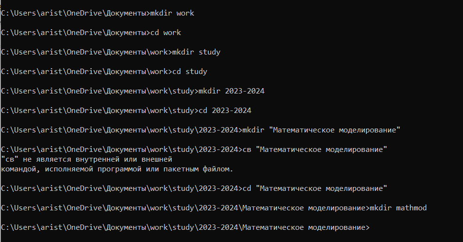{#fig:001 width=70%}

## Выполнение лабораторной работы

Клонирую заданный репозиторий на сайте github: 

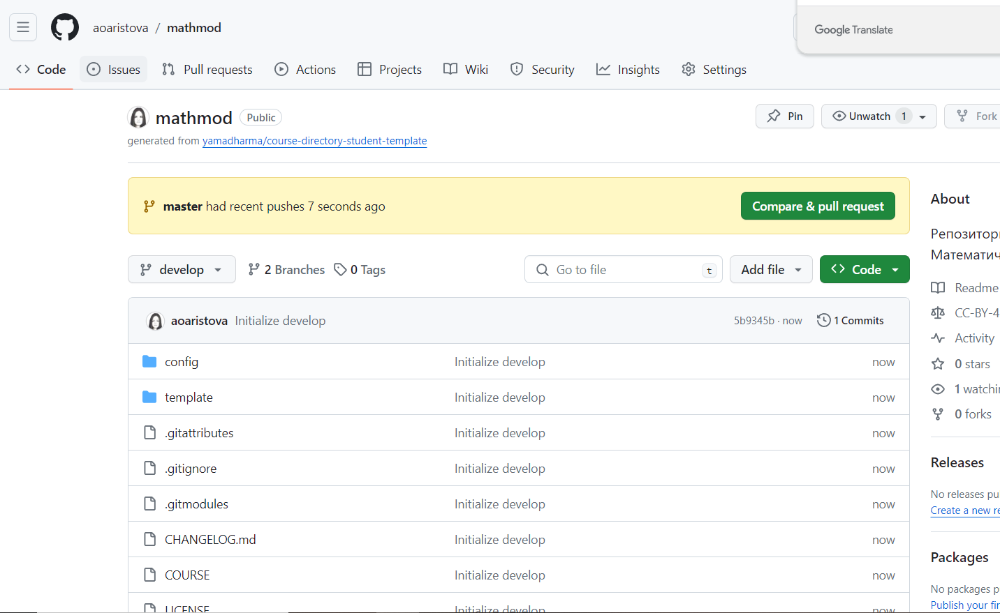{#fig:002 width=65%}

## Выполнение лабораторной работы

Устанавливаю необходимый для дальнейшей работы менеджер пакетов: 

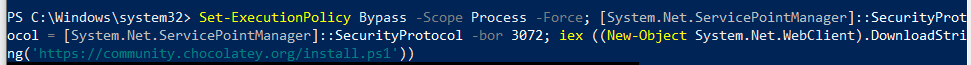{#fig:003 width=90%}

## Выполнение лабораторной работы

Проверяю установку: 

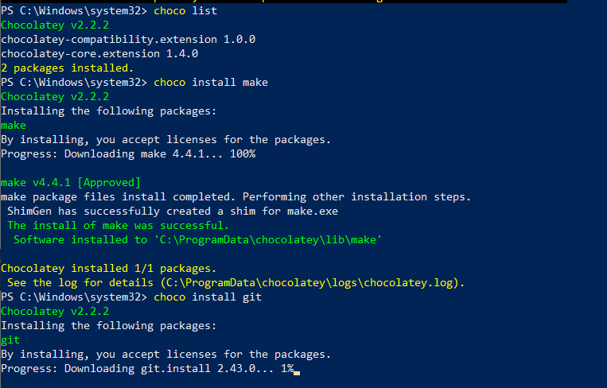{#fig:004 width=50%}

## Выполнение лабораторной работы

Создаю ssh-key: 

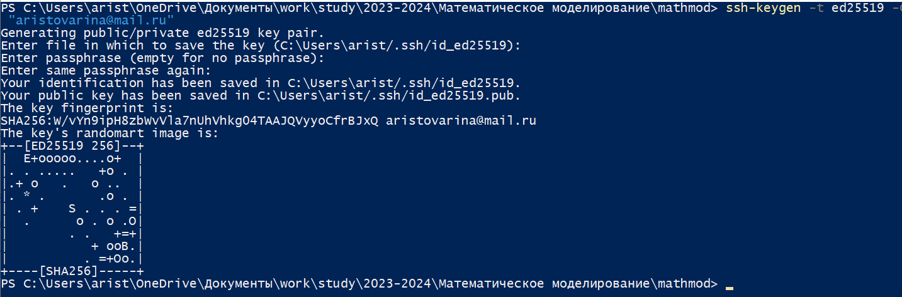{#fig:005 width=70%}

## Выполнение лабораторной работы

Запускаем агента: 

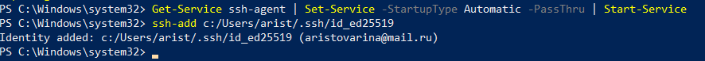{#fig:006 width=90%}

## Выполнение лабораторной работы

Добавляем созданный ключ в github: 

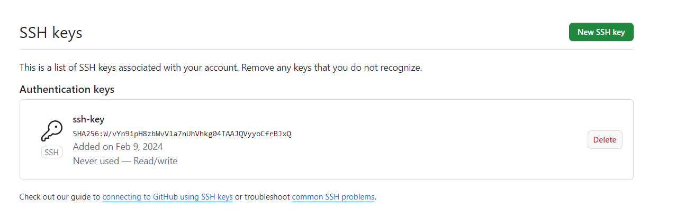{#fig:007 width=80%}

## Выполнение лабораторной работы

Выполняю некоторые настройки git: 

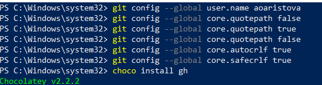{#fig:008 width=80%}

## Выполнение лабораторной работы

Устанавливаю github: 

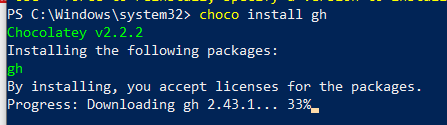{#fig:009 width=70%}

## Выполнение лабораторной работы

Авторизуюсь в github: 

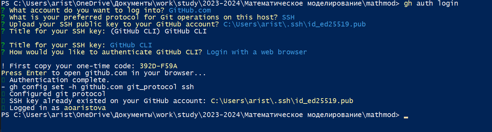{#fig:010 width=90%}

## Выполнение лабораторной работы

Клонирую заданный репозиторий с сайта github в указанную папку: 

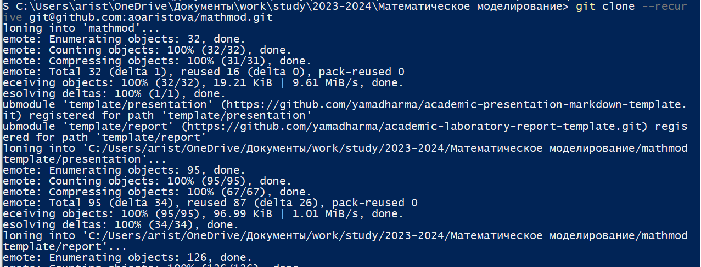{#fig:011 width=70%}

## Выполнение лабораторной работы

Удаляю лишние файлы, создаю необходимые каталоги, отправляю файлы на сервер: 

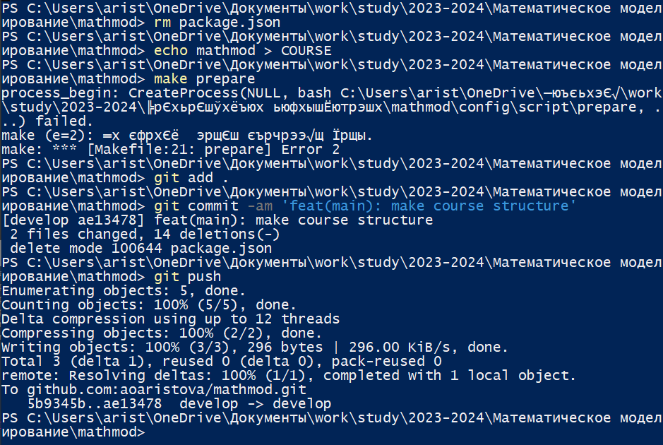{#fig:012 width=50%}

## Выполнение лабораторной работы

Устанавливаю необходимые пакеты:pandoc и pandoc-crossref: 

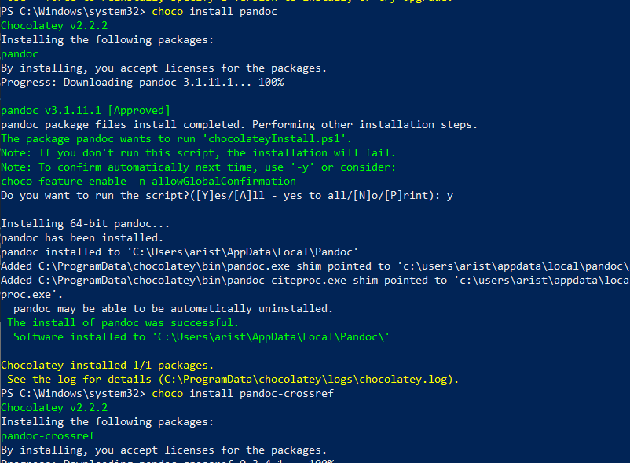{#fig:013 width=50%}

## Выполнение лабораторной работы

Получаем необходимые другие форматы отчета и презентации: 

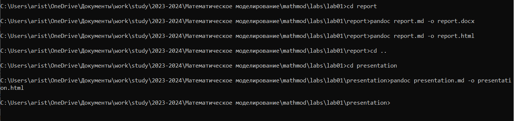{#fig:014 width=70%}

## Вывод

В процессе и по итогу выполнения лабораторной работы №1 я познакомилась с некоторыми новыми операциями git и подготовила всё необходимое для дальнейшего выполнения последующих лабораторных работ.

