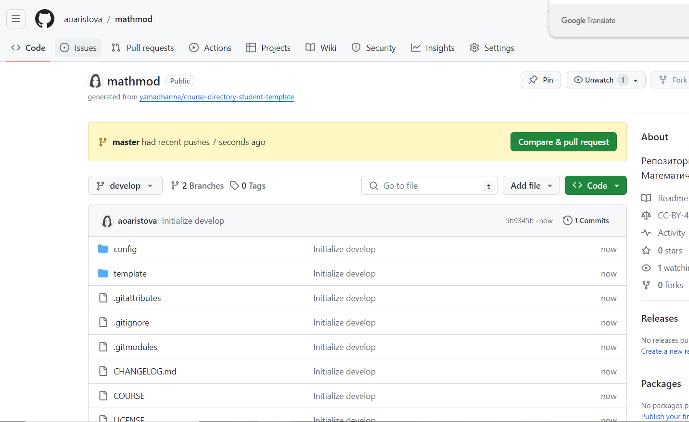
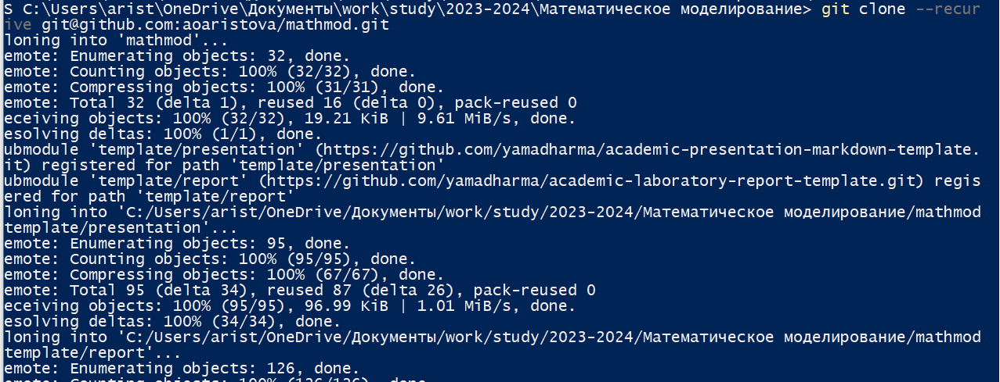

---
## Front matter
title: "Отчет к лабораторной работе 1"
subtitle: "Работа с git. Клонирование репозитория"
author: Аристова А.О."

## Generic otions
lang: ru-RU
toc-title: "Содержание"

## Bibliography
bibliography: bib/cite.bib
csl: pandoc/csl/gost-r-7-0-5-2008-numeric.csl

## Pdf output format
toc: true # Table of contents
toc-depth: 2
lof: true # List of figures
lot: true # List of tables
fontsize: 12pt
linestretch: 1.5
papersize: a4
documentclass: scrreprt
## I18n polyglossia
polyglossia-lang:
  name: russian
  options:
	- spelling=modern
	- babelshorthands=true
polyglossia-otherlangs:
  name: english
## I18n babel
babel-lang: russian
babel-otherlangs: english
## Fonts
mainfont: PT Serif
romanfont: PT Serif
sansfont: PT Sans
monofont: PT Mono
mainfontoptions: Ligatures=TeX
romanfontoptions: Ligatures=TeX
sansfontoptions: Ligatures=TeX,Scale=MatchLowercase
monofontoptions: Scale=MatchLowercase,Scale=0.9
## Biblatex
biblatex: true
biblio-style: "gost-numeric"
biblatexoptions:
  - parentracker=true
  - backend=biber
  - hyperref=auto
  - language=auto
  - autolang=other*
  - citestyle=gost-numeric
## Pandoc-crossref LaTeX customization
figureTitle: "Рис."
tableTitle: "Таблица"
listingTitle: "Листинг"
lofTitle: "Список иллюстраций"
lotTitle: "Список таблиц"
lolTitle: "Листинги"
## Misc options
indent: true
header-includes:
  - \usepackage{indentfirst}
  - \usepackage{float} # keep figures where there are in the text
  - \floatplacement{figure}{H} # keep figures where there are in the text
---

# Цель работы

Познакмиться с git, клонировать репозиторий для дальнейшей работы.

# Задание

Склонировать репозиторий, проверить правильность выполненных действий.

# Теоретическое введение

**Рабочее пространство по предмету располагается в следующей иерархии:**

work, study, учебный год, название предмета, код предмета

Каталог для лабораторных работ имеет вид labs.

Каталоги для лабораторных работ имеют вид lab<номер>, например: lab01, lab02 и т.д.

**Настройка каталога курса:**

*Удалите лишние файлы:*

rm package.json

**Создайте необходимые каталоги:**

echo mathmod > COURSE

make prepare

**Отправьте файлы на сервер:**

git add .

git commit -am 'feat(main): make course structure'

git push
                                                                             |

Более подробно про Unix см. в [@tanenbaum_book_modern-os_ru; @robbins_book_bash_en; @zarrelli_book_mastering-bash_en; @newham_book_learning-bash_en].

# Выполнение лабораторной работы

В начале создаю необходимые директории, как в задании: work, study, 2023-2024, Математическое моделирование, mathmod

{#fig:001 width=70%}

Клонирую заданный репозиторий на сайте github: (рис. [-@fig:002])

{#fig:002 width=70%}

Устанавливаю необходимый для дальнейшей работы менеджер пакетов: (рис. [-@fig:003])

{#fig:003 width=70%}

Проверяю установку: (рис. [-@fig:004])

{#fig:004 width=70%}

Создаю ssh-key: (рис. [-@fig:005])

{#fig:005 width=70%}

Запускаем агента: (рис. [-@fig:006])

{#fig:006 width=70%}

Добавляем созданный ключ в github: (рис. [-@fig:007])

{#fig:007 width=70%}

Выполняю некоторые настройки git: (рис. [-@fig:008])

{#fig:008 width=70%}

Устанавливаю github: (рис. [-@fig:009])

{#fig:009 width=70%}

Авторизуюсь в github: (рис. [-@fig:010])

{#fig:010 width=70%}

Клонирую заданный репозиторий с сайта github в указанную папку: (рис. [-@fig:011])

{#fig:011 width=70%}

Удаляю лишние файлы, создаю необходимые каталоги, отправляю файлы на сервер: (рис. [-@fig:012])

{#fig:012 width=70%}

Устанавливаю необходимые пакеты:pandoc и pandoc-crossref: (рис. [-@fig:013])

{#fig:013 width=70%}

Получаем необходимые другие форматы отчета и презентации: (рис. [-@fig:014])

{#fig:014 width=70%}

# Выводы

В процессе и по итогу выполнения лабораторной работы №1 я познакомилась с некоторыми новыми операциями git и подготовила всё необходимое для дальнейшего выполнения последующих лабораторных работ.

# Список литературы{.unnumbered}

- Описание лабораторной работы 
- Документация GitHub: https://docs.github.com/ru (статья "Создание нового ключа SSH и его добавление в ssh-agent": https://docs.github.com/ru/authentication/connecting-to-github-with-ssh/generating-a-new-ssh-key-and-adding-it-to-the-ssh-agent)

::: {#refs}
:::
