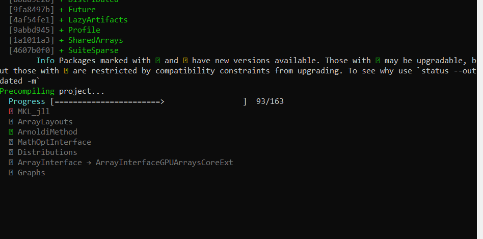
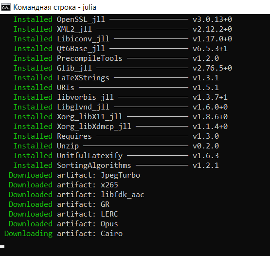
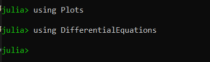
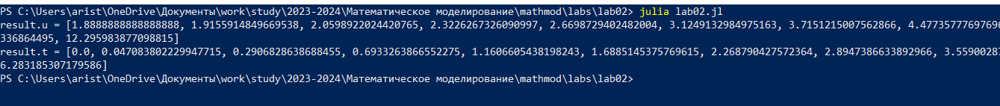
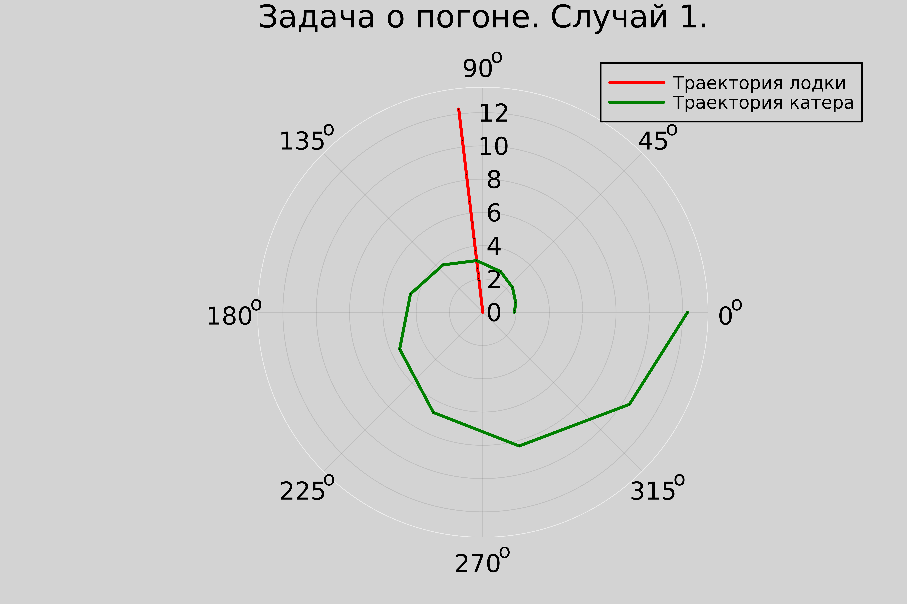
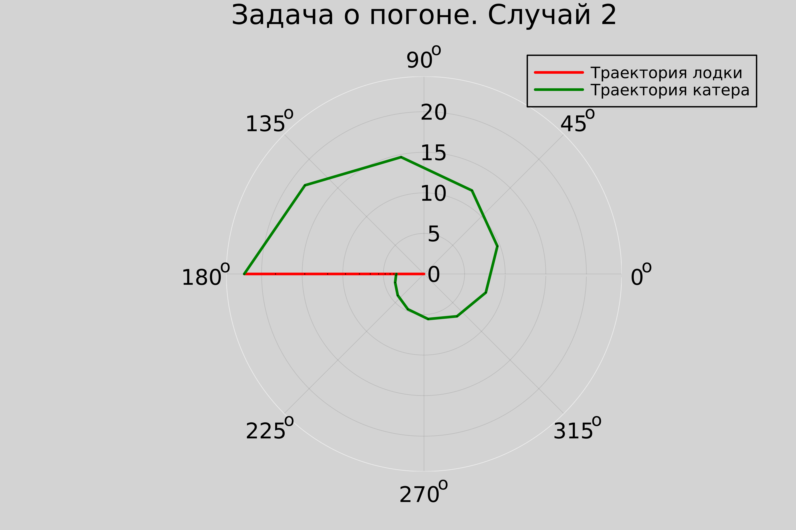

---
## Front matter
title: "Отчёт по лабораторной работе 2"
subtitle: "Задача о погоне"
author: "Аристова Арина Олеговна"

## Generic otions
lang: ru-RU
toc-title: "Содержание"

## Bibliography
bibliography: bib/cite.bib
csl: pandoc/csl/gost-r-7-0-5-2008-numeric.csl

## Pdf output format
toc: true # Table of contents
toc-depth: 2
lof: true # List of figures
lot: true # List of tables
fontsize: 12pt
linestretch: 1.5
papersize: a4
documentclass: scrreprt
## I18n polyglossia
polyglossia-lang:
  name: russian
  options:
	- spelling=modern
	- babelshorthands=true
polyglossia-otherlangs:
  name: english
## I18n babel
babel-lang: russian
babel-otherlangs: english
## Fonts
mainfont: PT Serif
romanfont: PT Serif
sansfont: PT Sans
monofont: PT Mono
mainfontoptions: Ligatures=TeX
romanfontoptions: Ligatures=TeX
sansfontoptions: Ligatures=TeX,Scale=MatchLowercase
monofontoptions: Scale=MatchLowercase,Scale=0.9
## Biblatex
biblatex: true
biblio-style: "gost-numeric"
biblatexoptions:
  - parentracker=true
  - backend=biber
  - hyperref=auto
  - language=auto
  - autolang=other*
  - citestyle=gost-numeric
## Pandoc-crossref LaTeX customization
figureTitle: "Рис."
tableTitle: "Таблица"
listingTitle: "Листинг"
lofTitle: "Список иллюстраций"
lotTitle: "Список таблиц"
lolTitle: "Листинги"
## Misc options
indent: true
header-includes:
  - \usepackage{indentfirst}
  - \usepackage{float} # keep figures where there are in the text
  - \floatplacement{figure}{H} # keep figures where there are in the text
---

# Цель работы

- Ознакомиться с основами языков программирования Julia и OpenModelica. 
- Освоить библиотеки этих языков, которые необходимы для построения графиков и решения дифференциальных уравнений. 
- Решить задачу «о погоне».

# Задание

## Вариант 4

На море в тумане катер береговой охраны преследует лодку браконьеров.
Через определенный промежуток времени туман рассеивается, и лодка
обнаруживается на расстоянии 8,5 км от катера. Затем лодка снова скрывается в
тумане и уходит прямолинейно в неизвестном направлении. Известно, что скорость
катера в 3,5 раза больше скорости браконьерской лодки.

1. Запишите уравнение, описывающее движение катера, с начальными 
условиями для двух случаев (в зависимости от расположения катера 
относительно лодки в начальный момент времени). 

2. Постройте траекторию движения катера и лодки для двух случаев.

3. Найдите точку пересечения траектории катера и лодки 

# Теоретическое введение

## О языках программирования

Julia – высокоуровневый язык, который разработан для научного программирования. Язык поддерживает широкий функционал для математических вычислений и работы с большими массивами данных.

OpenModelica — свободное открытое программное обеспечение для моделирования, симуляции, оптимизации и анализа сложных динамических систем. Основано на языке Modelica. Активно развивается Open Source Modelica Consortium, некоммерческой неправительственной организацией. Open Source Modelica Consortium является совместным проектом RISE SICS East AB и Линчёпингского университета. По своим возможностям приближается к таким вычислительным средам как Matlab Simulink, Scilab xCos, имея при этом значительно более удобное представление системы уравнений исследуемого блока.

## Математическая состаляющая

Дифференциальное уравнение содержит помимо функции, содержит ее производные. Порядок производных в уравнении может быть разным (не ограничен формально). В уравнении могут присутствовать производные, функции, независимые переменные и параметры в различных комбинациях или даже отсутствовать, за исключением хотя бы одной производной. Не каждое уравнение с производными неизвестной функции является дифференциальным.

В отличие от алгебраических уравнений, которые решаются для нахождения числа (или нескольких чисел), решение дифференциальных уравнений направлено на поиск функции (или семейства функций).

Дифференциальное уравнение высшего порядка можно преобразовать в систему уравнений первого порядка, где количество уравнений равно порядку исходного дифференциального уравнения.

## Физическая составляющая

- Тангенциальная скорость - компонента вектора скорости, перпендикулярная линии, соединяющей источник и наблюдателя. Измеряется через собственное движение - угловое перемещение источника.

- Радиальная скорость - проекция скорости точки на прямую, соединяющую ее с выбранным началом координат.

- Полярная система координат - двумерная система координат, в которой каждая точка на плоскости определяется двумя числами: полярным углом и полярным радиусом.


# Выполнение лабораторной работы

## Математическая модель

1. Начнем отсчет времени с первого момента исчезновения тумана.
Центром введенных полярных координат будем считать точку нахождения браконьеров, и осью, проходящей через катер береговой охраны. Тогда начальные координаты катера (8,5; 0). Обозначим скорость лодки $v$.

2. Для того чтобы траектория катера пересеклась с траекторией лодки, необходимо, чтобы оба судна всегда находились на одинаковом расстоянии от полюса. Поэтому в начале катер береговой охраны должен двигаться прямолинейно, пока не достигнет того же расстояния от полюса, что и лодка браконьеров. Затем катер должен двигаться вокруг полюса, удаляясь от него с такой же скоростью, как и лодка.

3.  Для определения расстояния x, после которого катер начнет двигаться по круговой траектории вокруг полюса, необходимо составить следующие уравнения. Преположим, что через время t катер и лодка окажутся на одинаковом расстоянии от полюса, равном $x$. Получается, что за t лодка пройдет $x$, а катер $8,5 + x$ (или $8,5 - x$, два случая, так как начальное положение катера относительно полюса может быть разным)
Чтобы вычислить время, время, за которое они пройдут это расстояние, составим уравнения: как $\frac{x}{v}$ или $\frac{8,5 - x}{3,5v}$ (во втором случае $\frac{8,5 + x}{3,5v}$). 
Эти величины равны, так как очевидно, что встретятся они через одно время. Получаем два разных уравнения (два случая, так как начальное положение катера относительно полюса может быть разным).

$$ \left[ \begin{array}{cl}
  \frac{x}{v} = \frac{8,5 - x}{3,5v}\\
  \frac{x}{v} = \frac{8,5 + x}{3,5v}
\end{array} \right. $$

Из данных уравнений можно найти расстояние, после которого катер начнёт раскручиваться 
по спирали. Для данных уравнений решения будут следующими: $x_1 = {\frac{17}{9}}$, 
$x_2 = {\frac{17}{5}}$. Задачу будем решать для двух случаев. 
После того, как катер береговой охраны окажется на одном расстоянии от полюса, 
что и лодка, он должен сменить прямолинейную траекторию и начать двигаться вокруг 
полюса удаляясь от него со скоростью лодки v. Для этого скорость катера раскладываем 
на две составляющие: 

$v_r = {\frac{dr}{dt}} = v$ - радиальная скорость и $v_\tau = r{\frac{d\theta}{dt}}$ - тангенциальная скорость.

4. Решение задачи сводится к системе из двух дифференциальных уравнений, описывающих движение катера вокруг полюса.:

$$ \left\{ \begin{array}{cl}
{\frac{dr}{dt}} = v \\
r{\frac{d\theta}{dt}} = {\sqrt{1125}v}
\end{array} \right. $$

Начальные условия для этих уравнений зависят от выбранной начальной позиции катера относительно полюса:

для одного случая: 

$$ \left\{ \begin{array}{cl}
\theta_0 = 0 \\
r_0 = x_1 = {\frac{17}{9}}
\end{array} \right. $$

для другого: 

$$ \left\{ \begin{array}{cl}
\theta_0 = -\pi \\
r_0 = x_2 = {\frac{17}{5}}
\end{array} \right. $$

Исключив из системы, которую мы получили, производную по t, можно перейти к следующему уравнению (с неизменными начальными условиями):

$$ {\frac{dr}{d\theta}} = {\frac{r}{\sqrt{1125}}} $$

Решив систему уравнений, получим траекторию движения катера в полярных координатах.

Решением задачи будем считать точку пересечения траекторий катера и лодки.


## Решение задачи в программной среде
В начале по заданной формуле определяю номер своего варианта: 

{#fig:001 width=70%}

Для работы мне необходимо установить программную среду julia, делаю это: 

{#fig:002 width=70%}

Также для выполнения лабораторной работы мне необходим установить следующие пакеты: Plots, DifferentialEquations. Устанавливаю их: 

{#fig:003 width=70%}

{#fig:004 width=70%}

Затем я проверяю корректность установки пакетов: 

{#fig:005 width=70%}

Затем я пишу программу на языке julia для получения графиков траекторий катера и лодки. Вот её листинг:

```julia
using Plots 
using DifferentialEquations

# Объявляем значения
const k = 8.5
const n = 3.5

# Начальные расстояния для двух разных случаев погони
r0 = k/(n+1)
r0_2 = k/(n-1)

# Задаем интервалы 
const T = (0, 2*pi)
const T2 = (-pi, pi)

# Задаем функцию, представляющую наше ДУ
function F(u, p, t)
	return u / sqrt(n*n - 1)
end

# Задаем проблему(задачу) для случая 1
problem = ODEProblem(F, r0, T)

# Решение для случая 1
result = solve(problem, abstol=1e-8, reltol=1e-8)

@show result.u
@show result.t

dxR = rand(1:size(result.t)[1])
rAngles = [result.t[dxR] for i in 1:size(result.t)[1]]

# График траекторий для случая 1
plt1 = plot(proj=:polar, aspect_ratio=:equal, dpi = 1000, legend=true, bg=:lightgrey)

# Настрою холст
plot!(plt1, xlabel="theta", ylabel="r(t)", title="Задача о погоне. Случай 1.", legend=:best)

plot!(plt1, [rAngles[1], rAngles[2]], [0.0, result.u[size(result.u)[1]]], label="Траектория лодки", color=:red, lw=2)
scatter!(plt1, rAngles, result.u, label="", mc=:red, ms=0.0005)
plot!(plt1, result.t, result.u, xlabel="theta", ylabel="r(t)", label="Траектория катера", color=:green, lw=2)
scatter!(plt1, result.t, result.u, label="", mc=:green, ms=0.0005)

savefig(plt1, "lab02_img1.png")

# Задаем проблему(задачу) для случая 2
problem = ODEProblem(F, r0_2 , T2)

# Решение для случая 2
result = solve(problem, abstol=1e-8, reltol=1e-8)
dxR = rand(1:size(result.t)[1])
rAngles = [result.t[dxR] for i in 1:size(result.t)[1]]

# График траекторий для случая 2
plt2 = plot(proj=:polar, aspect_ratio=:equal, dpi = 1000, legend=true, bg=:lightgrey)

# Настрою холст
plot!(plt2, xlabel="theta", ylabel="r(t)", title="Задача о погоне. Случай 2", legend=:best)
plot!(plt2, [rAngles[1], rAngles[2]], [0.0, result.u[size(result.u)[1]]], label="Траектория лодки", color=:red, lw=2)
scatter!(plt2, rAngles, result.u, label="", mc=:red, ms=0.0005)
plot!(plt2, result.t, result.u, xlabel="theta", ylabel="r(t)", label="Траектория катера", color=:green, lw=2)
scatter!(plt2, result.t, result.u, label="", mc=:green, ms=0.0005)

savefig(plt2, "lab02_img2.png")
```

Выполняю эту программу: 

{#fig:006 width=70%}

В итоге получаю следующие графики: 

{#fig:007 width=70%}

{#fig:008 width=70%}

Можем заметить, что решением задачи является точка пересечения линий графика, то есть точка пересечения траекторий катера и лодки.

# Анализ полученных результатов

В результате выполнения данной лабораторной работы мною были получены графики для обоих случаев. На них изображены траектории катера и лодки, что позволило наглядно определить точки их пересечения. Задача о погоне была успешно решена.

# Выводы

В процессе и результате выполнения лабораторной работы я ознакомилась с 
основами программирования на языках Julia и OpenModelica. 
Также я освоила библиотеки этих языков, которые используются для 
создания графиков и решения дифференциальных уравнений. 
В данной лабораторной работе я использовала язык Julia для работы с 
полярными координатами.


# Список литературы. Библиография

1. Документация по Julia: https://docs.julialang.org/en/v1/

2. Документация по OpenModelica: https://openmodelica.org/

3. Документация по работе с пакетом Plots: https://docs.juliaplots.org/latest/tutorial/

4. Решение дифференциальных уравнений: https://www.wolframalpha.com/

5. Решение дифференциальных уравнений: http://www.mathprofi.ru/differencialnye_uravnenija_primery_reshenii.html


