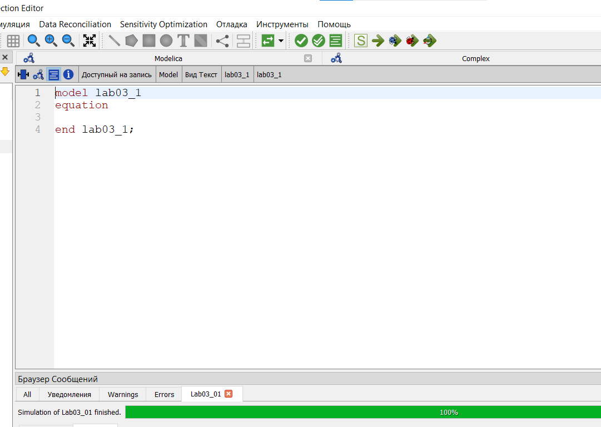
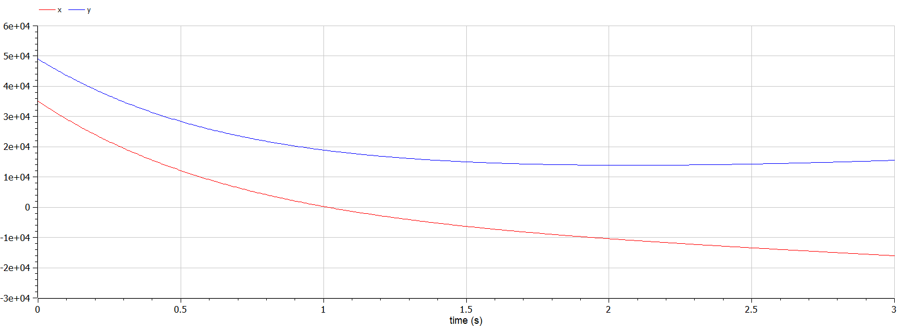
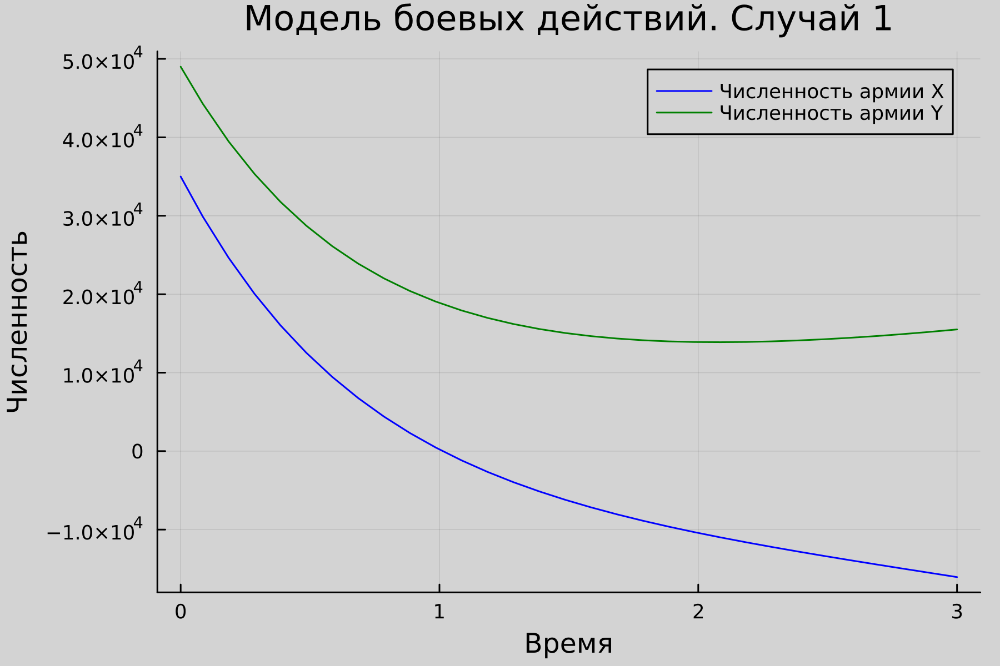
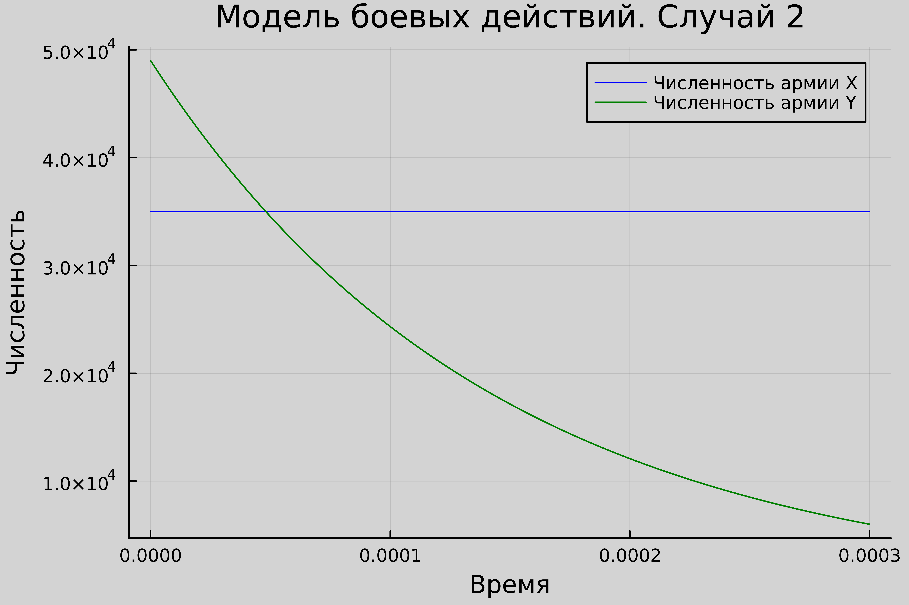
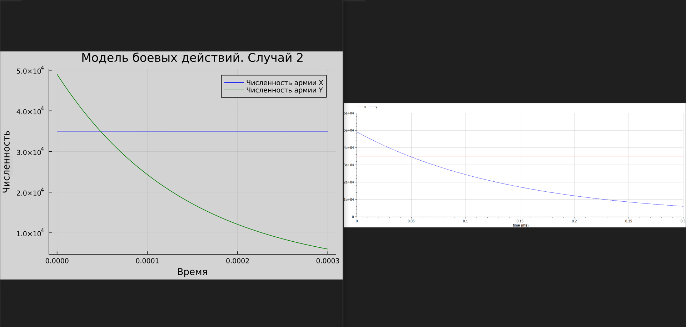

---
## Front matter
lang: ru-RU
title: Презентация к лабораторной работе 3
subtitle: Модель боевых действий
author:
  - Аристова А. О.
institute:
  - Российский университет дружбы народов, Москва, Россия
date: 19 февраля 2024

## i18n babel
babel-lang: russian
babel-otherlangs: english

## Formatting pdf
toc: false
toc-title: Содержание
slide_level: 2
aspectratio: 169
section-titles: true
theme: metropolis
header-includes:
 - \metroset{progressbar=frametitle,sectionpage=progressbar,numbering=fraction}
 - '\makeatletter'
 - '\beamer@ignorenonframefalse'
 - '\makeatother'
---

# Информация

## Докладчик

:::::::::::::: {.columns align=center}
::: {.column width="70%"}

* Аристова Арина Олеговна
  * студентка группы НФбд-01-21
  * Российский университет дружбы народов
  * [1032216433@rudn.ru](mailto:1032216433@rudn.ru)
  * <https://github.com/aoaristova>

:::
::: {.column width="30%"}


:::
::::::::::::::

# Вводная часть

## Цели и задачи

- Продолжить ознакомление с языками программирования Julia и OpenModelica. 
- Ознакомиться с моделями боевых действий Ланчестера
- Решить задачу на тему «Модель боевых действий»

# Задание 

## Вариант 4:


Между страной Х и страной У идет война. Численность состава войск 
исчисляется от начала войны, и являются временными функциями 
x(t) и y(t). В начальный момент времени страна Х имеет армию численностью 35 000 человек, а 
в распоряжении страны У армия численностью в 49 000 человек. Для упрощения 
модели считаем, что коэффициенты a, b, c и h постоянны. Также считаем 
P(t) и Q(t) - непрерывные функции.
Постройте графики изменения численности войск армии Х и армии У для 
следующих случаев:

## Вариант 4:

1.	Модель боевых действий между регулярными войсками

	$$ \frac{dx}{dt} = -0.55*x(t) - 0.9*y(t) + 2*|sin(t)| $$

	$$ \frac{dy}{dt} = -0.8*x(t) - 0.63*y(t) + cos(13*t) + 1 $$

## Вариант 4:

2.	Модель ведение боевых действий с участием регулярных войск и 
партизанских отрядов 


	$$ \frac{dx}{dt} = -0.35*x(t) - 0.46*y(t) + 1.5*|sin(2t)| $$

	$$ \frac{dy}{dt} = -0.2*x(t)*y(t) - 0.6*y(t) + cos(0.5*t) + 1 $$

## Теоретическое введение

### О языках программирования

Julia – высокоуровневый язык, который разработан для научного программирования. Язык поддерживает широкий функционал для математических вычислений и работы с 
большими массивами данных[1]. 

OpenModelica — свободное открытое программное обеспечение для моделирования, симуляции, оптимизации и анализа сложных динамических систем. 
Основано на языке Modelica. Активно развивается Open Source Modelica Consortium, некоммерческой неправительственной организацией. Open Source Modelica 
Consortium является совместным проектом RISE SICS East AB и Линчёпингского университета. По своим возможностям приближается к таким вычислительным средам как 
Matlab Simulink, Scilab xCos, имея при этом значительно более удобное представление системы уравнений исследуемого блока [2].

## Теоретическое введение

### Математическая состаляющая

Законы Ланчестера (законы Осипова — Ланчестера) — 
математическая формула для расчета относительных сил пары сражающихся сторон — подразделений вооруженных сил.
Уравнения Ланчестера — это дифференциальные уравнения, 
описывающие зависимость между силами сражающихся сторон A и D как функцию от времени, причем функция зависит только от A и D [3].

## Теоретическое введение

### Математическая состаляющая

В 1916 году, в разгар первой мировой войны, 
Фредерик Ланчестер разработал систему дифференциальных уравнений для демонстрации соотношения между противостоящими силами. 
Среди них есть так называемые Линейные законы Ланчестера (первого рода или честного боя, для рукопашного боя или неприцельного огня) 
и Квадратичные законы Ланчестера (для войн начиная с XX века с применением прицельного огня, дальнобойных орудий, огнестрельного оружия). 
В связи с установленным приоритетом в англоязычной литературе наметилась тенденция перехода от фразы «модель Ланчестера» к «модели Осипова — Ланчестера» [4].

## Теоретическое введение

### Математическая состаляющая

Рассмотренные простейшие модели соперничества соответствуют системам обыкновенных дифференциальных уравнений второго порядка, широко распространенным при описании многих естественно научных объектов.
Не смотря на то, что модель сильно идеализирована и не применима к реальной ситуации и жизни, однако может применяться для начального анализа и при том быть очень полезна [3,4]. 

# Выполнение лабораторной работы 

## Математическая модель

Рассматриваются три случая ведения боевых действий:

1. Боевые действия между регулярными войсками

2. Боевые действия с участием регулярных войск и партизанских 
отрядов 

3. Боевые действия между партизанскими отрядами 


## Математическая модель

В ***первом*** случае численность регулярных войск определяется тремя 
факторами:

- скорость уменьшения численности войск из-за причин, не связанных с 
боевыми действиями (болезни, травмы, дезертирство);

- скорость потерь, обусловленных боевыми действиями 
противоборствующих сторон (что связанно с качеством стратегии, 
уровнем вооружения, профессионализмом солдат и т.п.);

- скорость поступления подкрепления (задаётся некоторой функцией от 
времени).

## Математическая модель

В этом случае модель боевых действий между регулярными войсками 
описывается следующим образом:

$$ \frac{dx}{dt} = -a(t)*x(t) - b(t)*y(t) + P(t) $$

$$ \frac{dy}{dt} = -c(t)*x(t) - h(t)*y(t) + Q(t) $$

## Математическая модель

Потери, не связанные с боевыми действиями, описывают члены $$-a(t)*x(t),-h(t)*x(t)$$
Следующие члены $$-b(t)*y(t), -c(t)*x(t)$$ отражают потери на поле боя. 
Коэффициенты b(t) и c(t) указывают на эффективность боевых действий со 
стороны у и х соответственно, $$a(t), h(t)$$ - величины, характеризующие степень 
влияния различных факторов на потери. Функции $$P(t), Q(t)$$ учитывают 
возможность подхода подкрепления к войскам Х и У в течение одного дня.

## Математическая модель

Во ***втором*** случае в борьбу добавляются партизанские отряды. Нерегулярные 
войска в отличии от постоянной армии менее уязвимы, так как действуют скрытно, 
в этом случае сопернику приходится действовать неизбирательно, по площадям, 
занимаемым партизанами. Поэтому считается, что тем потерь партизан, 
проводящих свои операции в разных местах на некоторой известной территории, 
пропорционален не только численности армейских соединений, но и численности 
самих партизан. В результате модель принимает вид:

$$ \frac{dx}{dt} = a(t)*x(t) - b(t)*y(t) + P(t) $$

$$ \frac{dy}{dt} = c(t)*x(t)*y(t) - h(t)*y(t) + Q(t) $$

## Математическая модель

Модель ведение боевых действий между партизанскими отрядами с учетом 
предположений, сделанном в предыдущем случаем, имеет вид (***третий случай***):

$$ \frac{dx}{dt} = a(t)*x(t) - b(t)*x(t)*y(t) + P(t) $$

$$ \frac{dy}{dt} = h(t)*y(t) - c(t)*x(t)*y(t) + Q(t) $$


## Решение задачи в программной среде 

Мой вариант лабораторной работы: 4. Я получила его по заданной формуле: 

{#fig:001 width=70%}


## Решение задачи в программной среде 

Для решения данной лабораторной работы мною я писала код на языке Julia, среду для него я устанавливала ранее, это Вы можете найти в описании, докладе и презентации к Лабораторной работе Также для решения данной лабораторной работы мне необходимо установить среду разработки OpenModelica. Я сделала это:

{#fig:002 width=35%}

## Решение задачи в программной среде 

Затем я ознакомилась с интерфейсом и функционалом OpenModelica:

{#fig:003 width=50%}

## Решение задачи в программной среде 

Затем я написала код для получения необходимых графиков.


Вот листинг кода для получения первой модели: 

```
model lab03_1
Real x;
Real y;

Real a = 0.55;
Real b = 0.9;
Real c = 0.8;
Real h = 0.63;
Real t = time;
```

## Решение задачи в программной среде 

```
initial equation
x = 35000;
y = 49000;

equation 
der(x) = -a*x - b*y + 2*abs(sin(t));
der(y) = -c*x - h*y + cos(13*t) + 1;

end lab03_1;
```

## Решение задачи в программной среде 

Вот листинг кода для получения второй модели: 

```
model lab03_2
Real x;
Real y;

Real a = 0.35;
Real b = 0.46;
Real c = 0.2;
Real d = 0.6;
Real t = time;
```

## Решение задачи в программной среде 

```
initial equation
x = 35000;
y = 49000;

equation
der(x) = -a*x - b*y + 1.5*abs(sin(2*t));
der(y) = -c*x*y - d*y + cos(0.5*t)+1;
end lab03_2;
```

## Решение задачи в программной среде 

Затем я сохранила полученные мной результаты в изображения. 

{#fig:004 width=80%}

## Решение задачи в программной среде 

Затем я сохранила полученные мной результаты в изображения. 

{#fig:005 width=80%}

## Решение задачи в программной среде 

Затем я приступила к написанию программы на языке Julia. Вот её листинг:

```julia
using Plots;
using DifferentialEquations;
# Функция, представляющие наши ДУ. Случай 1
function first(du, u, p, t)
    du[1] = - 0.55*u[1] - 0.9*u[2] + 2 * abs(sin(t))
    du[2] = - 0.8*u[1] - 0.63*u[2] + cos(13 * t)
end
# Функция, представляющие наши ДУ. Случай 2
function second(du, u, p, t)
    du[1] = - 0.35*u[1] - 0.46*u[2] + 1.5 * abs(sin(2 * t))
    du[2] = (- 0.2*u[1] - 0.6)*u[2] + cos(0.5 * t) + 1
end
```

## Решение задачи в программной среде 

```julia
# Необходимые константы: количество людей, промежутки для обоих случаев
const people = Float64[35000, 49000]
const prom1 = [0.0, 3.0]
const prom2 = [0.0, 0.0003]
# Задаем проблемы(задачи) для обоих случаев
problem1 = ODEProblem(first, people, prom1)
problem2 = ODEProblem(second, people, prom2)
# Решения для обоих случаев
result1 = solve(problem1, dtmax=0.1)
result2 = solve(problem2, dtmax=0.000001)
```

## Решение задачи в программной среде 

```julia
# Данные массивы будут хранить численность x (A11, A21), 
#численность y(A12,A22) в момент времени t (T1, T2)
A11 = [u[1] for u in result1.u]
A12 = [u[2] for u in result1.u]
T1 = [t for t in result1.t]
A21 = [u[1] for u in result2.u]
A22 = [u[2] for u in result2.u]
T2 = [t for t in result2.t]
```

## Решение задачи в программной среде 

```julia
# Создаю холст 1
plt1 = plot(dpi = 300, legend= true, bg =:lightgrey)

# Настраиваю холст 1
plot!(plt1, xlabel="Время", ylabel="Численность", 
title="Модель боевых действий. Случай 1", legend=:best, lw=:2)
plot!(plt1, T1, A11, label="Численность армии X", color =:blue)
plot!(plt1, T1, A12, label="Численность армии Y", color =:green)
# Сохраняю результат в файл
savefig(plt1, "lab03_1.png")
```
## Решение задачи в программной среде 

```julia
# Создаю холст 2
plt2 = plot(dpi = 1200, legend= true, bg =:lightgrey)

# Настраиваю холст 2
plot!(plt2, xlabel="Время", ylabel="Численность", 
title="Модель боевых действий. Случай 2", legend=:best, lw=:2)
plot!(plt2, T2, A21, label="Численность армии X", color =:blue)
plot!(plt2, T2, A22, label="Численность армии Y", color =:green)
# Сохраняю результат в файл
savefig(plt2, "lab03_2.png")
```

## Решение задачи в программной среде 

Затем я выполнила написанную мною ранее программу: 

{#fig:006 width=9z0%}

## Решение задачи в программной среде 

В итоге я получила следующие графики: 

{#fig:007 width=50%}

## Решение задачи в программной среде 

В итоге я получила следующие графики: 

{#fig:008 width=50%}


## Анализ полученных результатов

В результате выполнения данной лабораторной работы мною были получены 
графики для обоих рассматриваемых случаев (боевых действий между регулярными войсками, боевых действий с участием регулярных войск и партизанских отрядов) с помощью Julia и OpenModelica. Важно отметить, что по содержанию графики получились идентичными, 
выполненные на обоих языках, как для первого, так и для второго случая.


## Анализ полученных результатов

{#fig:009 width=50%}

## Анализ полученных результатов

{#fig:010 width=50%}

## Выводы

В процессе и результате выполнения лабораторной работы я продолжила знакомиться с языками Julia и OpenModelica. По итогам завершения выполнения лабораторной работы я получила четыре изображения графиков: 2 из них были выполнены с помощью Julia, а другие 2 – с помощью OpenModelica. 

Также можно сделать предварительный вывод о том, что подобную работу производить гораздо проще, быстрее и удобнее на языке OpenModelica, так как построение подобной модели (процесса, протекающего во времени) занимает горадно меньше как строк, так и времени.


## Список литературы. Библиография

[1] Документация по Julia: https://docs.julialang.org/en/v1/ 

[2] Документация по OpenModelica: https://openmodelica.org/  

[3] О законах Ланчестера https://www.socionauki.ru/journal/articles/130365/ 

[4] Законы-Ланчестера (Осипова-Ланчестера): https://ru.wikipedia.org/wiki/%D0%97%D0%B0%D0%BA%D0%BE%D0%BD%D1%8B_%D0%9E%D1%81%D0%B8%D0%BF%D0%BE%D0%B2%D0%B0_%E2%80%94_%D0%9B%D0%B0%D0%BD%D1%87%D0%B5%D1%81%D1%82%D0%B5%D1%80%D0%B0 

