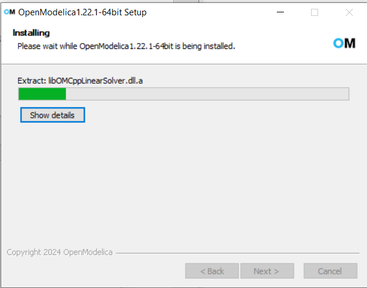
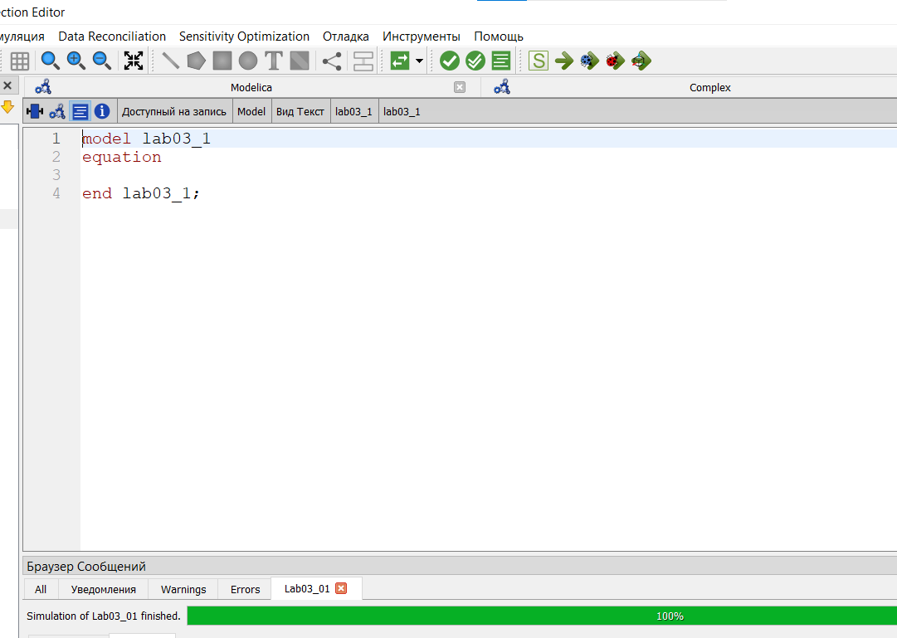
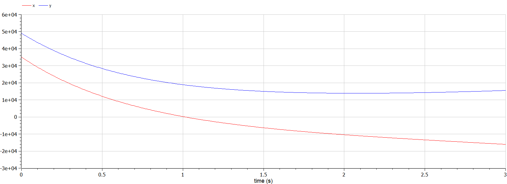
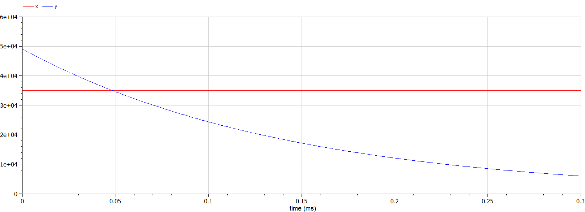
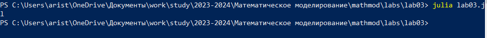
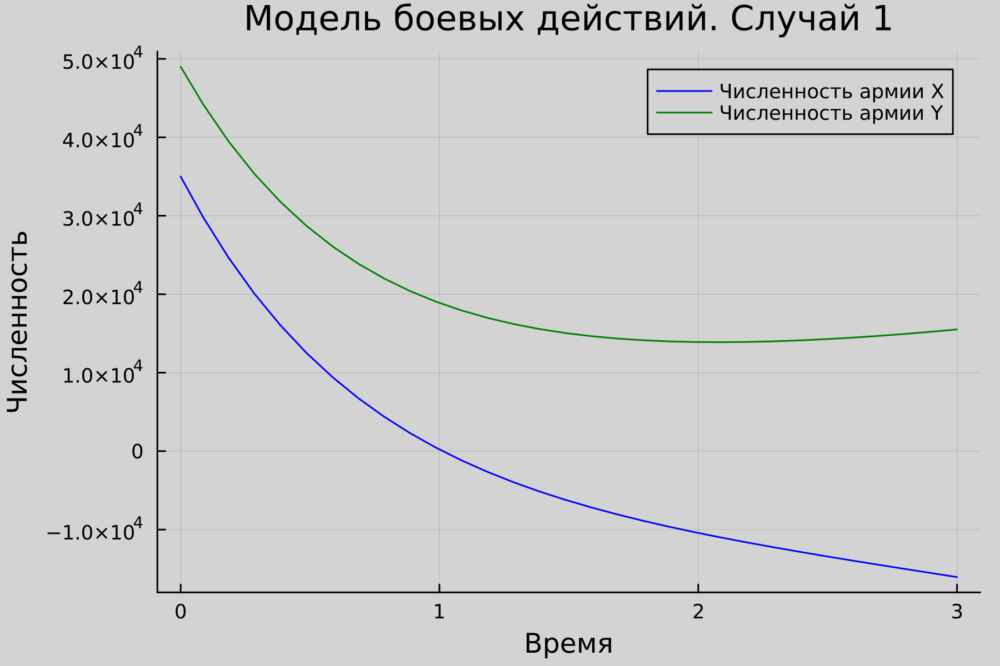
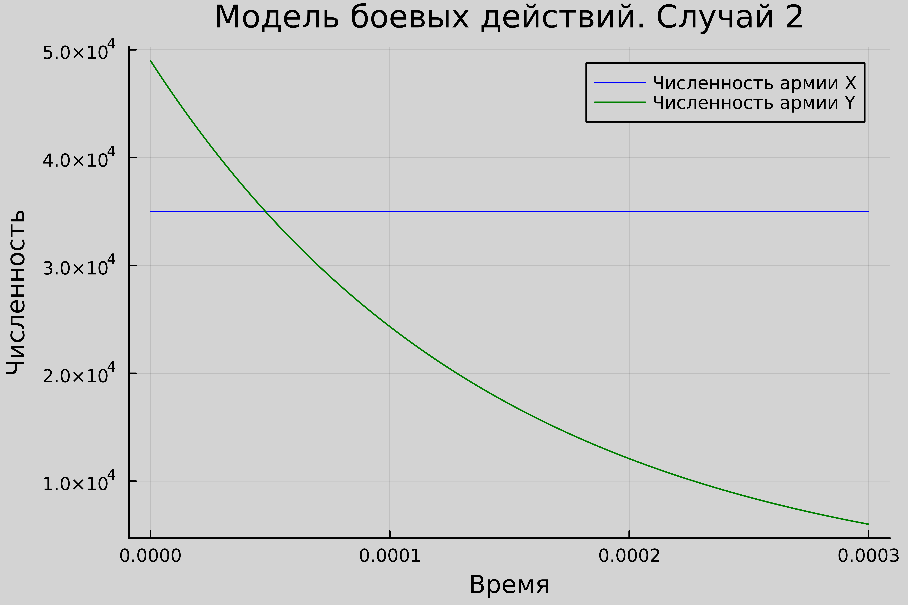
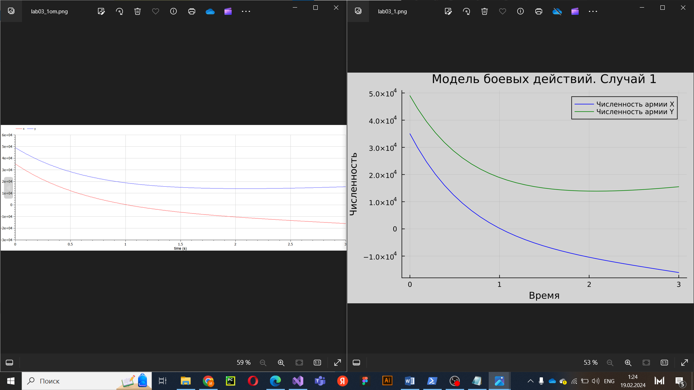
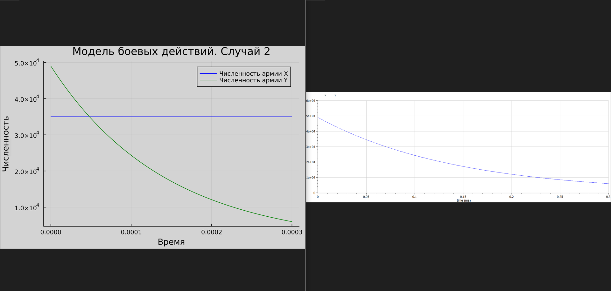

---
## Front matter
title: "Отчёт по лабораторной работе 3"
subtitle: "Модель боевых действий "
author: "Аристова Арина Олеговна"

## Generic otions
lang: ru-RU
toc-title: "Содержание"

## Bibliography
bibliography: bib/cite.bib
csl: pandoc/csl/gost-r-7-0-5-2008-numeric.csl

## Pdf output format
toc: true # Table of contents
toc-depth: 2
lof: true # List of figures
lot: true # List of tables
fontsize: 12pt
linestretch: 1.5
papersize: a4
documentclass: scrreprt
## I18n polyglossia
polyglossia-lang:
  name: russian
  options:
	- spelling=modern
	- babelshorthands=true
polyglossia-otherlangs:
  name: english
## I18n babel
babel-lang: russian
babel-otherlangs: english
## Fonts
mainfont: PT Serif
romanfont: PT Serif
sansfont: PT Sans
monofont: PT Mono
mainfontoptions: Ligatures=TeX
romanfontoptions: Ligatures=TeX
sansfontoptions: Ligatures=TeX,Scale=MatchLowercase
monofontoptions: Scale=MatchLowercase,Scale=0.9
## Biblatex
biblatex: true
biblio-style: "gost-numeric"
biblatexoptions:
  - parentracker=true
  - backend=biber
  - hyperref=auto
  - language=auto
  - autolang=other*
  - citestyle=gost-numeric
## Pandoc-crossref LaTeX customization
figureTitle: "Рис."
tableTitle: "Таблица"
listingTitle: "Листинг"
lofTitle: "Список иллюстраций"
lotTitle: "Список таблиц"
lolTitle: "Листинги"
## Misc options
indent: true
header-includes:
  - \usepackage{indentfirst}
  - \usepackage{float} # keep figures where there are in the text
  - \floatplacement{figure}{H} # keep figures where there are in the text
---

# Цель работы

- Продолжить ознакомление с языками программирования Julia и OpenModelica. 
- Ознакомиться с моделями боевых действий Ланчестера
- Решить задачу на тему «Модель боевых действий»

# Задание

## Вариант 4

Между страной Х и страной У идет война. Численность состава войск 
исчисляется от начала войны, и являются временными функциями 
x(t) и y(t). В начальный момент времени страна Х имеет армию численностью 35 000 человек, а 
в распоряжении страны У армия численностью в 49 000 человек. Для упрощения 
модели считаем, что коэффициенты a, b, c и h постоянны. Также считаем 
P(t) и Q(t) - непрерывные функции.
Постройте графики изменения численности войск армии Х и армии У для 
следующих случаев:

1.	Модель боевых действий между регулярными войсками

	$$ \frac{dx}{dt} = -0.55*x(t) - 0.9*y(t) + 2*|sin(t)| $$

	$$ \frac{dy}{dt} = -0.8*x(t) - 0.63*y(t) + cos(13*t) + 1 $$

2.	Модель ведение боевых действий с участием регулярных войск и 
партизанских отрядов 


	$$ \frac{dx}{dt} = -0.35*x(t) - 0.46*y(t) + 1.5*|sin(2t)| $$

	$$ \frac{dy}{dt} = -0.2*x(t)*y(t) - 0.6*y(t) + cos(0.5*t) + 1 $$

# Теоретическое введение

## О языках программирования

Julia – высокоуровневый язык, который разработан для научного программирования. Язык поддерживает широкий функционал для математических вычислений и работы с 
большими массивами данных[1]. 

OpenModelica — свободное открытое программное обеспечение для моделирования, симуляции, оптимизации и анализа сложных динамических систем. 
Основано на языке Modelica. Активно развивается Open Source Modelica Consortium, некоммерческой неправительственной организацией. Open Source Modelica 
Consortium является совместным проектом RISE SICS East AB и Линчёпингского университета. По своим возможностям приближается к таким вычислительным средам как 
Matlab Simulink, Scilab xCos, имея при этом значительно более удобное представление системы уравнений исследуемого блока [2].

## Математическая состаляющая

Законы Ланчестера (законы Осипова — Ланчестера) — 
математическая формула для расчета относительных сил пары сражающихся сторон — подразделений вооруженных сил.
Уравнения Ланчестера — это дифференциальные уравнения, 
описывающие зависимость между силами сражающихся сторон A и D как функцию от времени, причем функция зависит только от A и D [3].

В 1916 году, в разгар первой мировой войны, 
Фредерик Ланчестер разработал систему дифференциальных уравнений для демонстрации соотношения между противостоящими силами. 
Среди них есть так называемые Линейные законы Ланчестера (первого рода или честного боя, для рукопашного боя или неприцельного огня) 
и Квадратичные законы Ланчестера (для войн начиная с XX века с применением прицельного огня, дальнобойных орудий, огнестрельного оружия). 
В связи с установленным приоритетом в англоязычной литературе наметилась тенденция перехода от фразы «модель Ланчестера» к «модели Осипова — Ланчестера» [4].

Рассмотренные простейшие модели соперничества соответствуют системам обыкновенных дифференциальных уравнений второго порядка, широко распространенным при описании многих естественно научных объектов.
Не смотря на то, что модель сильно идеализирована и не применима к реальной ситуации и жизни, однако может применяться для начального анализа и при том быть очень полезна [3,4]. 

# Выполнение лабораторной работы

## Математическая модель

Рассматриываются три случая ведения боевых действий:

1. Боевые действия между регулярными войсками

2. Боевые действия с участием регулярных войск и партизанских 
отрядов 

3. Боевые действия между партизанскими отрядами 

В ***первом*** случае численность регулярных войск определяется тремя 
факторами:

- скорость уменьшения численности войск из-за причин, не связанных с 
боевыми действиями (болезни, травмы, дезертирство);

- скорость потерь, обусловленных боевыми действиями 
противоборствующих сторон (что связанно с качеством стратегии, 
уровнем вооружения, профессионализмом солдат и т.п.);

- скорость поступления подкрепления (задаётся некоторой функцией от 
времени).

В этом случае модель боевых действий между регулярными войсками 
описывается следующим образом:

$$ \frac{dx}{dt} = -a(t)*x(t) - b(t)*y(t) + P(t) $$

$$ \frac{dy}{dt} = -c(t)*x(t) - h(t)*y(t) + Q(t) $$

Потери, не связанные с боевыми действиями, описывают члены $$-a(t)*x(t),-h(t)*x(t)$$
Следующие члены $$-b(t)*y(t), -c(t)*x(t)$$ отражают потери на поле боя. 
Коэффициенты b(t) и c(t) указывают на эффективность боевых действий со 
стороны у и х соответственно, $$a(t), h(t)$$ - величины, характеризующие степень 
влияния различных факторов на потери. Функции $$P(t), Q(t)$$ учитывают 
возможность подхода подкрепления к войскам Х и У в течение одного дня

Во ***втором*** случае в борьбу добавляются партизанские отряды. Нерегулярные 
войска в отличии от постоянной армии менее уязвимы, так как действуют скрытно, 
в этом случае сопернику приходится действовать неизбирательно, по площадям, 
занимаемым партизанами. Поэтому считается, что тем потерь партизан, 
проводящих свои операции в разных местах на некоторой известной территории, 
пропорционален не только численности армейских соединений, но и численности 
самих партизан. В результате модель принимает вид:

$$ \frac{dx}{dt} = a(t)*x(t) - b(t)*y(t) + P(t) $$

$$ \frac{dy}{dt} = c(t)*x(t)*y(t) - h(t)*y(t) + Q(t) $$

Модель ведение боевых действий между партизанскими отрядами с учетом 
предположений, сделанном в предыдущем случаем, имеет вид (***третий случай***):

$$ \frac{dx}{dt} = a(t)*x(t) - b(t)*x(t)*y(t) + P(t) $$

$$ \frac{dy}{dt} = h(t)*y(t) - c(t)*x(t)*y(t) + Q(t) $$

## Решение задачи в программной среде

Мой вариант лабораторной работы: 4. Я получила его по заданной формуле: 

{#fig:001 width=70%}

Для решения данной лабораторной работы мною я писала код на языке Julia, среду для него я устанавливала ранее, это Вы можете найти в описании, докладе и презентации к Лабораторной работе Также для решения данной лабораторной работы мне необходимо установить среду разработки OpenModelica. Я сделала это:

{#fig:002 width=70%}

Затем я ознакомилась с интерфейсом и функционалом OpenModelica:

{#fig:003 width=70%}

Затем я написала код для получения необходимых графиков.


Вот листинг кода для получения первой модели: 

```
model lab03_1
Real x;
Real y;

Real a = 0.55;
Real b = 0.9;
Real c = 0.8;
Real h = 0.63;
Real t = time;

initial equation
x = 35000;
y = 49000;

equation 
der(x) = -a*x - b*y + 2*abs(sin(t));
der(y) = -c*x - h*y + cos(13*t) + 1;

end lab03_1;
```

Вот листинг кода для получения второй модели: 

```
model lab03_2
Real x;
Real y;

Real a = 0.35;
Real b = 0.46;
Real c = 0.2;
Real d = 0.6;
Real t = time;

initial equation
x = 35000;
y = 49000;

equation
der(x) = -a*x - b*y + 1.5*abs(sin(2*t));
der(y) = -c*x*y - d*y + cos(0.5*t)+1;
end lab03_2;
```
Затем я сохранила полученные мной результаты в изображения. 

{#fig:004 width=70%}

{#fig:005 width=70%}

Затем я приступила к написанию программы на языке Julia. Вот её листинг:

```julia
using Plots;
using DifferentialEquations;

# Функция, представляющие наши ДУ. Случай 1
function first(du, u, p, t)
    du[1] = - 0.55*u[1] - 0.9*u[2] + 2 * abs(sin(t))
    du[2] = - 0.8*u[1] - 0.63*u[2] + cos(13 * t)
end

# Функция, представляющие наши ДУ. Случай 2
function second(du, u, p, t)
    du[1] = - 0.35*u[1] - 0.46*u[2] + 1.5 * abs(sin(2 * t))
    du[2] = (- 0.2*u[1] - 0.6)*u[2] + cos(0.5 * t) + 1
end

# Необходимые константы: количество людей, промежутки для обоих случаев
const people = Float64[35000, 49000]
const prom1 = [0.0, 3.0]
const prom2 = [0.0, 0.0003]

# Задаем проблемы(задачи) для обоих случаев
problem1 = ODEProblem(first, people, prom1)
problem2 = ODEProblem(second, people, prom2)

# Решения для обоих случаев
result1 = solve(problem1, dtmax=0.1)
result2 = solve(problem2, dtmax=0.000001)


# Данные массивы будут хранить численность x (A11, A21), численность y(A12,A22) в момент времени t (T1, T2)
A11 = [u[1] for u in result1.u]
A12 = [u[2] for u in result1.u]
T1 = [t for t in result1.t]
A21 = [u[1] for u in result2.u]
A22 = [u[2] for u in result2.u]
T2 = [t for t in result2.t]

# Создаю холст 1
plt1 = plot(dpi = 300, legend= true, bg =:lightgrey)

# Настраиваю холст 1
plot!(plt1, xlabel="Время", ylabel="Численность", title="Модель боевых действий. Случай 1", legend=:best, lw=:2)
plot!(plt1, T1, A11, label="Численность армии X", color =:blue)
plot!(plt1, T1, A12, label="Численность армии Y", color =:green)

# Сохраняю результат в файл
savefig(plt1, "lab03_1.png")

# Создаю холст 2
plt2 = plot(dpi = 1200, legend= true, bg =:lightgrey)

# Настраиваю холст 2
plot!(plt2, xlabel="Время", ylabel="Численность", title="Модель боевых действий. Случай 2", legend=:best, lw=:2)
plot!(plt2, T2, A21, label="Численность армии X", color =:blue)
plot!(plt2, T2, A22, label="Численность армии Y", color =:green)

# Сохраняю результат в файл
savefig(plt2, "lab03_2.png")
```

Затем я выполнила написанную мною ранее программу: 

{#fig:006 width=70%}

В итоге я получила следующие графики: 

{#fig:007 width=70%}

{#fig:008 width=70%}


# Анализ полученных результатов

В результате выполнения данной лабораторной работы мною были получены 
графики для обоих рассматриваемых случаев (боевых действий между регулярными войсками, боевых действий с участием регулярных войск и партизанских отрядов) с помощью Julia и OpenModelica. Важно отметить, что по содержанию графики получились идентичными, 
выполненные на обоих языках, как для первого, так и для второго случая.

{#fig:009 width=50%}

{#fig:010 width=50%}


# Выводы

В процессе и результате выполнения лабораторной работы я продолжила знакомиться с языками Julia и OpenModelica. По итогам завершения выполнения лабораторной работы я получила четыре изображения графиков: 2 из них были выполнены с помощью Julia, а другие 2 – с помощью OpenModelica. 

Также можно сделать предварительный вывод о том, что подобную работу производить гораздо проще, быстрее и удобнее на языке OpenModelica, так как построение подобной модели (процесса, протекающего во времени) занимает горадно меньше как строк, так и времени.


# Список литературы. Библиография

[1] Документация по Julia: https://docs.julialang.org/en/v1/ 

[2] Документация по OpenModelica: https://openmodelica.org/  

[3] О законах Ланчестера https://www.socionauki.ru/journal/articles/130365/ 

[4] Законы-Ланчестера (Осипова-Ланчестера): https://ru.wikipedia.org/wiki/%D0%97%D0%B0%D0%BA%D0%BE%D0%BD%D1%8B_%D0%9E%D1%81%D0%B8%D0%BF%D0%BE%D0%B2%D0%B0_%E2%80%94_%D0%9B%D0%B0%D0%BD%D1%87%D0%B5%D1%81%D1%82%D0%B5%D1%80%D0%B0 

