---
## Front matter
title: "Отчёт по лабораторной работе 4"
subtitle: "Модель гармонических колебаний "
author: "Аристова Арина Олеговна"

## Generic otions
lang: ru-RU
toc-title: "Содержание"

## Bibliography
bibliography: bib/cite.bib
csl: pandoc/csl/gost-r-7-0-5-2008-numeric.csl

## Pdf output format
toc: true # Table of contents
toc-depth: 2
lof: true # List of figures
lot: true # List of tables
fontsize: 12pt
linestretch: 1.5
papersize: a4
documentclass: scrreprt
## I18n polyglossia
polyglossia-lang:
  name: russian
  options:
	- spelling=modern
	- babelshorthands=true
polyglossia-otherlangs:
  name: english
## I18n babel
babel-lang: russian
babel-otherlangs: english
## Fonts
mainfont: PT Serif
romanfont: PT Serif
sansfont: PT Sans
monofont: PT Mono
mainfontoptions: Ligatures=TeX
romanfontoptions: Ligatures=TeX
sansfontoptions: Ligatures=TeX,Scale=MatchLowercase
monofontoptions: Scale=MatchLowercase,Scale=0.9
## Biblatex
biblatex: true
biblio-style: "gost-numeric"
biblatexoptions:
  - parentracker=true
  - backend=biber
  - hyperref=auto
  - language=auto
  - autolang=other*
  - citestyle=gost-numeric
## Pandoc-crossref LaTeX customization
figureTitle: "Рис."
tableTitle: "Таблица"
listingTitle: "Листинг"
lofTitle: "Список иллюстраций"
lotTitle: "Список таблиц"
lolTitle: "Листинги"
## Misc options
indent: true
header-includes:
  - \usepackage{indentfirst}
  - \usepackage{float} # keep figures where there are in the text
  - \floatplacement{figure}{H} # keep figures where there are in the text
---

# Цель работы

- Изучить понятие гармонического осциллятора, 
- Построить фазовый портрет гармонического осциллятора,
- Найти решение уравнения гармонического осциллятора.

# Задание

## Вариант 4

Постройте фазовый портрет гармонического осциллятора и решение уравнения 
гармонического осциллятора для следующих случаев 

1. Колебания гармонического осциллятора без затуханий и без действий внешней 
силы  $\ddot{x} + 15{x}=0$

2. Колебания гармонического осциллятора c затуханием и без действий внешней 
силы  $\ddot{x} + 10\dot{x}+ {x}=0$

3. Колебания гармонического осциллятора c затуханием и под действием внешней 
силы  $\ddot{x} + 3\dot{x}+ {x}=sin(3t)$. 
На интервале $t\in [0;55]$ (шаг $0.05$) с начальными условиями $x_0=0, y_0=2$

# Теоретическое введение


Julia – высокоуровневый язык, который разработан для научного программирования. Язык поддерживает широкий функционал для математических вычислений и работы с 
большими массивами данных[1]. 

OpenModelica — свободное открытое программное обеспечение для моделирования, симуляции, оптимизации и анализа сложных динамических систем. 
Основано на языке Modelica. Активно развивается Open Source Modelica Consortium, некоммерческой неправительственной организацией. Open Source Modelica 
Consortium является совместным проектом RISE SICS East AB и Линчёпингского университета. По своим возможностям приближается к таким вычислительным средам как 
Matlab Simulink, Scilab xCos, имея при этом значительно более удобное представление системы уравнений исследуемого блока [2].

- Осцилля́тор (лат. oscillo — качаюсь) — система, совершающая колебания, то есть показатели которой периодически повторяются во времени. 

- Гармонический осциллятор [3] — система, которая при смещении из положения равновесия испытывает действие возвращающей силы F, пропорциональной смещению x.

- Гармоническое колебание [4] - колебание, в процессе которого величины, характеризующие движение (смещение, скорость, ускорение и др.), изменяются по закону синуса или косинуса (гармоническому закону).

Движение грузика на пружинке, маятника, заряда в электрическом контуре, а 
также эволюция во времени многих систем в физике, химии, биологии и других 
науках при определенных предположениях можно описать одним и тем же 
дифференциальным уравнением, которое в теории колебаний выступает в качестве 
основной модели. Эта модель называется линейным гармоническим осциллятором.

Уравнение свободных колебаний гармонического осциллятора имеет 
следующий вид:

(1): $$\ddot{x}+2\gamma\dot{x}+\omega_0^2=0$$

где $x$ - переменная, описывающая состояние системы (смещение грузика, заряд конденсатора
и т.д.), $\gamma$ - параметр, характеризующий потери энергии (трение в механической 
системе, сопротивление в контуре), $\omega_0$ - собственная частота колебаний, $t$ - время.
(Обозначения $$\ddot{x} = \frac{\delta^2 x}{\delta t^2}, \dot{x} = \frac{\delta x}{\delta t} $$)

Уравнение (1) есть линейное однородное дифференциальное уравнение 
второго порядка и оно является примером линейной динамической системы.
При отсутствии потерь в системе $( \gamma = 0 )$ вместо уравнения (1.1) получаем 
уравнение консервативного осциллятора энергия колебания которого сохраняется 
во времени.

(2): $$ \ddot{x} + \omega_0^2 x$$

Для однозначной разрешимости уравнения второго порядка (2) необходимо 
задать два начальных условия вида: 

(3): 

$$ \left\{ \begin{array}{cl}
{x(t_0) = x_0 }\\
{\dot{x}(t_0) = y_0}
\end{array} \right. $$

Уравнение второго порядка (2) можно представить в виде системы двух 
уравнений первого порядка:

(4):

$$ \left\{ \begin{array}{cl}
{\dot{x} = y }\\
{\dot{y} = -\omega_0^2 x}
\end{array} \right. $$

Начальные условия (3) для системы (4) примут вид:

(5):

$$ \left\{ \begin{array}{cl}
{x(t_0) = x_0 }\\
{y(t_0) = y_0}
\end{array} \right. $$

Независимые переменные x, y определяют пространство, в котором 
«движется» решение. Это фазовое пространство системы, поскольку оно двумерно 
будем называть его фазовой плоскостью.

Значение фазовых координат x, y в любой момент времени полностью 
определяет состояние системы. Решению уравнения движения как функции 
времени отвечает гладкая кривая в фазовой плоскости. Она называется фазовой 
траекторией. Если множество различных решений (соответствующих различным 
начальным условиям) изобразить на одной фазовой плоскости, возникает общая 
картина поведения системы. 

Такую картину, образованную набором фазовых 
траекторий, называют фазовым портретом.

# Выполнение лабораторной работы

Мой вариант лабораторной работы: 4. Я получила его по заданной формуле:

{#fig:001 width=70%}

Затем я написала 3 программы для каждого из случаев на языке Julia:

Вот листинг первой программы для случая **без затуханий и без действий внешней 
силы:** $$ \ddot{x} + 15x = 0 $$

```julia
using Plots; gr()
using DifferentialEquations;

# Случай 1: x'' + 15*x = 0

function lorenz!(du, u, p, t)
	a = p;
	du[1] = u[2];
	du[2] = -a*u[1]
end

# Задаем начальные условия
const x = 0;
const y = 2;
u0 = [x, y]

p = 15
tspan = [0, 55]

# Задаем задачу 
problem = ODEProblem(lorenz!, u0, tspan, p)

# Решение данной задачи

solution = solve(problem, dtmax = 0.05)

# Создаю холст 1
plot(solution)

# Сохраняю результат в файл
savefig("lab04_1_julia.png")

# Создаю холст 2
plot(solution, vars=(2,1))

# Сохраняю результат в файл
savefig("lab04_1_pp_julia.png")
```

Полученный результат: 

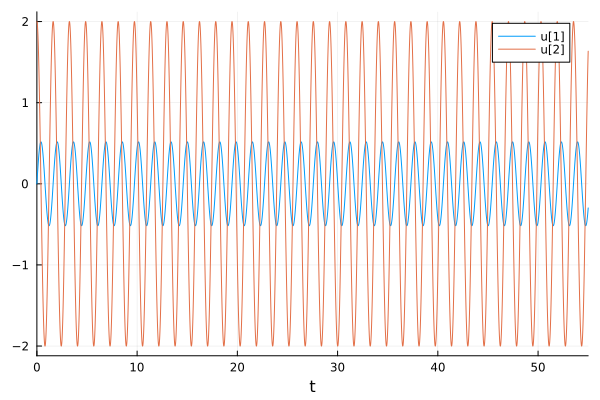{#fig:002 width=70%}

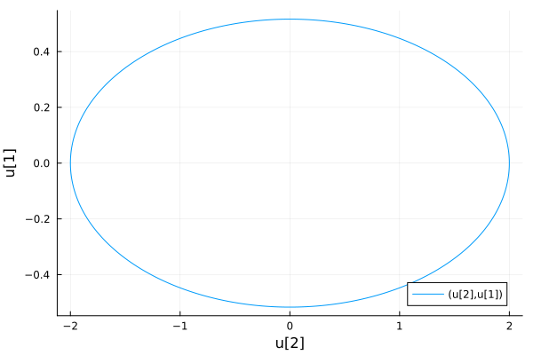{#fig:003 width=70%}

Вот листинг второй программы для случая **c затуханием и без действий внешней 
силы:** $$ \ddot{x} + 10\dot{x}x + x = 0 $$

```julia
using Plots; gr()
using DifferentialEquations;

# Случай 2: x'' + 10*x' + x = 0

function lorenz!(du, u, p, t)
	a, b = p;
	du[1] = u[2];
	du[2] = -a*du[1] -b*u[1]
end

# Задаем начальные условия
const x = 0;
const y = 2;
u0 = [x, y]

p = (sqrt(10), 1)
tspan = (0.0, 55.0)

# Задаем задачу 
problem = ODEProblem(lorenz!, u0, tspan, p)

# Решение данной задачи

solution = solve(problem, dtmax = 0.05)

# Создаю холст 1
plot(solution)

# Сохраняю результат в файл
savefig("lab04_2_julia.png")

# Создаю холст 2
plot(solution, vars=(2,1))

# Сохраняю результат в файл
savefig("lab04_2_pp_julia.png")
```

Полученный результат: 

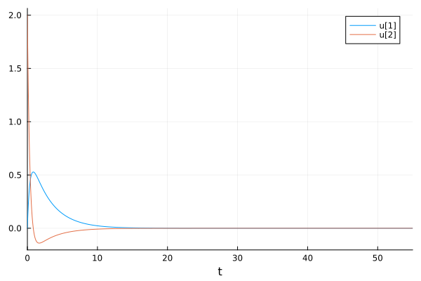{#fig:004 width=70%}

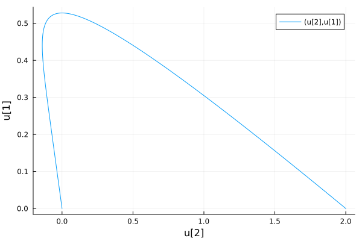{#fig:005 width=70%}

Вот листинг третьей программы для случая **c затуханием и под действием внешней 
силы:** $$ \ddot{x} + 3\dot{x} + x = sin(3t) $$

```julia
using Plots; gr()
using DifferentialEquations;

# Случай 3: x'' + 3*x' + x = sin(3*t)

function lorenz!(du, u, p, t)
	a, b = p;
	du[1] = u[2];
	du[2] = -a*du[1] -b*u[1] + sin(3*t)
end

# Задаем начальные условия
const x = 0;
const y = 2;
u0 = [x, y]

p = (sqrt(3), 1)
tspan = (0.0, 55.0)

# Задаем задачу 
problem = ODEProblem(lorenz!, u0, tspan, p)

# Решение данной задачи

solution = solve(problem, dtmax = 0.05)

# Создаю холст 1
plot(solution)

# Сохраняю результат в файл
savefig("lab04_3_julia.png")

# Создаю холст 2
plot(solution, vars=(2,1))

# Сохраняю результат в файл
savefig("lab04_3_pp_julia.png")
```

Полученный результат: 

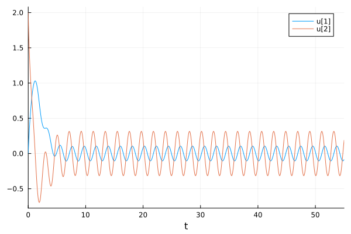{#fig:006 width=70%}

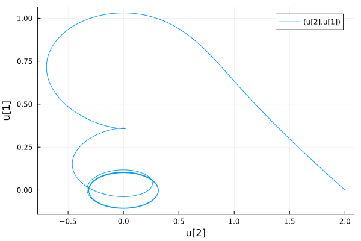{#fig:007 width=70%}

Затем я написала 3 программы для каждого из случаев для получения решений на языке Modelica в OpenModelica:

Вот листинг первой программы для случая **без затуханий и без действий внешней 
силы:** $$ \ddot{x} + 15x = 0 $$

```
//Задание 1: x''+ 15x = 0
model lab4_1 
//x'' + g* x' + w^2* x = f(t) 
//w - частота 
//g - затухание 
parameter Real w = sqrt(15.0);  
parameter Real g =0;  

// Начальные условия 
parameter Real x0 = 0; 
parameter Real y0 = 2; 

Real x(start=x0); 
Real y(start=y0); 

// Внешнее воздействие 
function f 
input Real t ; 
output Real res; 
algorithm  
res := 0; 
end f; 

equation 
der(x) = y; 
der(y) = -w*w*x - g*y + f(time); 
end lab4_1;
```

Полученный результат: 

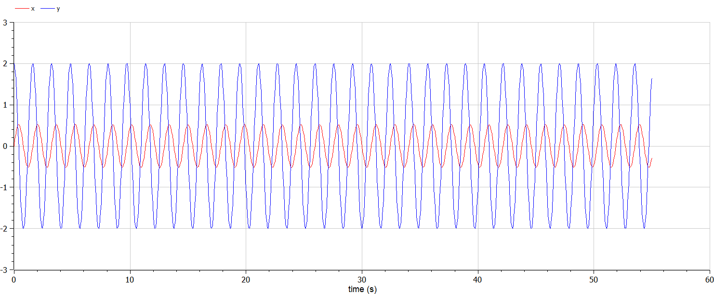{#fig:008 width=70%}

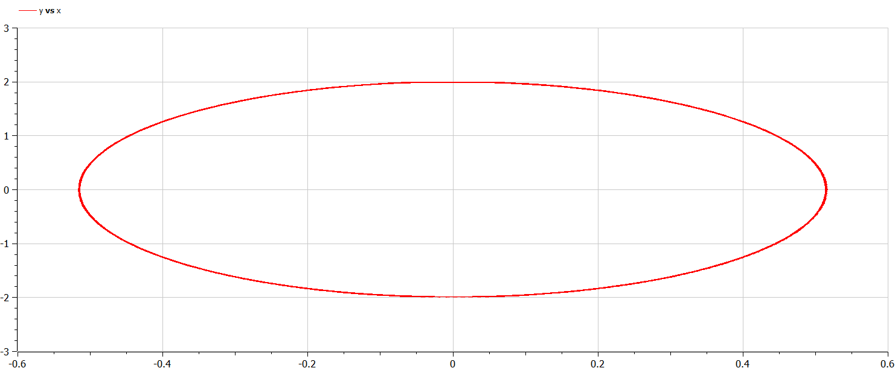{#fig:009 width=70%}

Вот листинг второй программы для случая **c затуханием и без действий внешней 
силы:** $$ \ddot{x} + 10\dot{x}x + x = 0 $$

```
//Задание 2: x'' + 10x' + x = 0
model lab4_2

//Параметры осциллятора
//x'' + g* x' + w^2* x = f(t)
//w - частота
//g - затухание
parameter Real w = sqrt(1);  
parameter Real g = 10;  

parameter Real x0 = 0; 
parameter Real y0 = 2; 

Real x(start=x0); 
Real y(start=y0); 

// f(t) 
function f 
input Real t ; 
output Real res; 
algorithm  
res := 0; 
end f; 

equation 
der(x) = y; 
der(y) = -w*w*x - g*y + f(time); 

end lab4_2;
```

Полученный результат: 

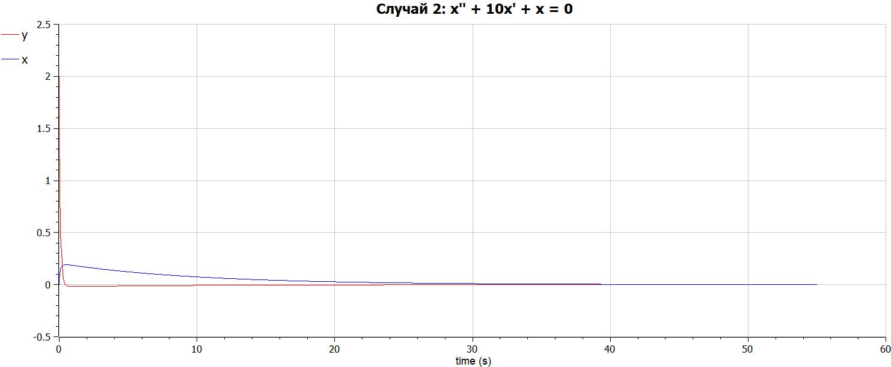{#fig:010 width=70%}

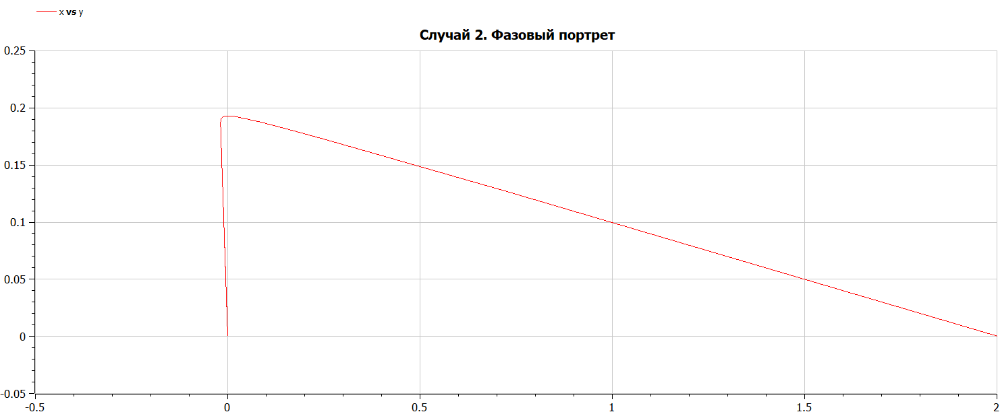{#fig:011 width=70%}

Вот листинг третьей программы для случая **c затуханием и под действием внешней 
силы:** $$ \ddot{x} + 3\dot{x} + x = sin(3t) $$

```
//Задание3: x'' + 3x' + x = sin(3t)
model lab4_3

//Параметры осциллятора
//x'' + g* x' + w^2* x = f(t)
//w - частота
//g - затухание
parameter Real w = sqrt(1);  
parameter Real g = 3;  

// Начальные условия
parameter Real x0 = 0; 
parameter Real y0 = 2; 

Real x(start=x0); 
Real y(start=y0); 

// Внешнее воздействие 
function f 
input Real t ; 
output Real res; 
algorithm  
res := sin(3*t); 
end f; 

equation 
der(x) = y; 
der(y) = -w*w*x - g*y - f(time); 
end lab4_3;
```

Полученный результат: 

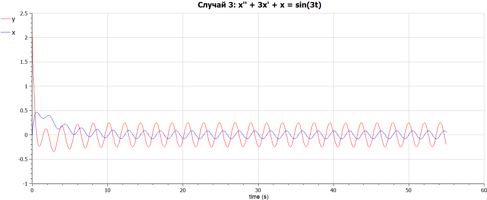{#fig:012 width=70%}

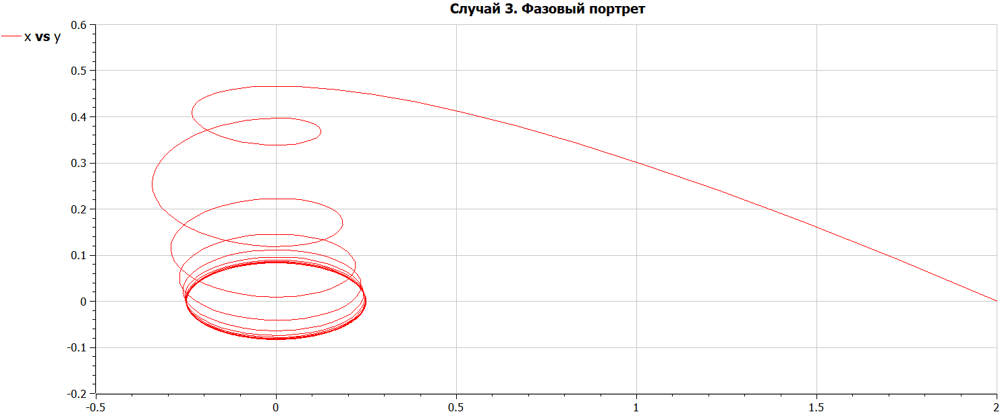{#fig:013 width=70%}


# Анализ полученных результатов 

В результате выполнения работы я построила по три модели (включающих в себя графики решения и фазовой модели системы ) 
на языках Julia и OpenModelica. По итогам выполнения задания, можно сделать вывод о том, что построение моделей колебания на языке Modelica занимает меньше строк, чем аналогичное построение на Julia.
Поэтому удобнее делать это, скорее, на первом, нежели на втором.

# Выводы

В процессе и результате выполнения лабораторной работы я построила 
три графика решения различных уравнений гармонического осциллятора и три 
фазовых портрета системы при гармонических колебаний без затухания; с затуханием и без действия внешней силы; с затуханием и при действии внешней силы на языках Julia и Open Modelica.

# Список литературы. Библиография {.unnumbered}

[1] Документация по Julia: https://docs.julialang.org/en/v1/ 

[2] Документация по OpenModelica: https://openmodelica.org/  

[3] Решение дифференциальных уравнений: http://www.mathprofi.ru/differencialnye_uravnenija_primery_reshenii.html

[4] Справка по осциллятору: https://ru.wikipedia.org/wiki/%D0%9E%D1%81%D1%86%D0%B8%D0%BB%D0%BB%D1%8F%D1%82%D0%BE%D1%80
