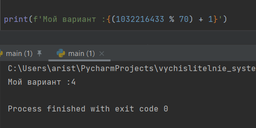
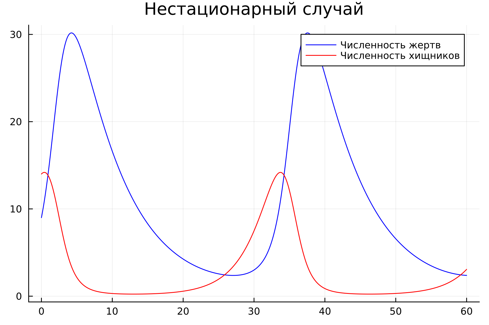
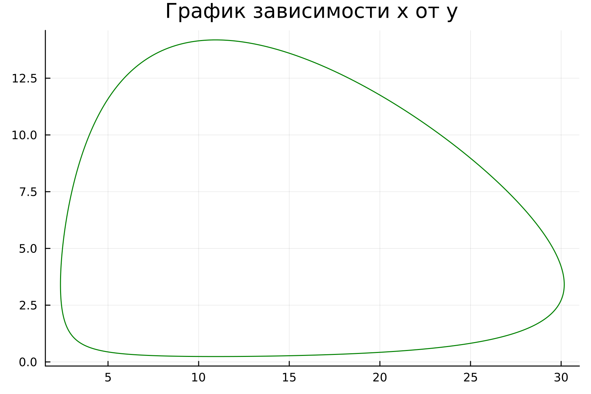
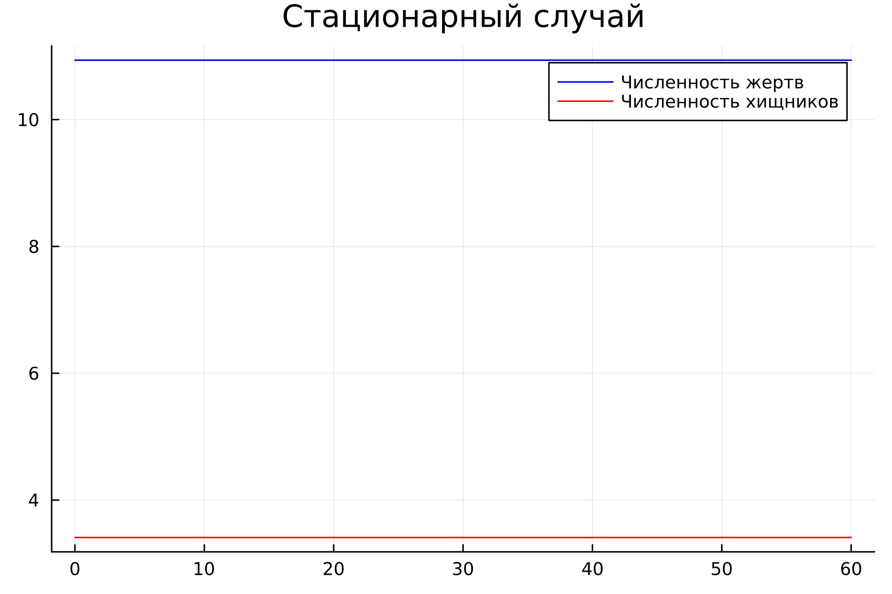
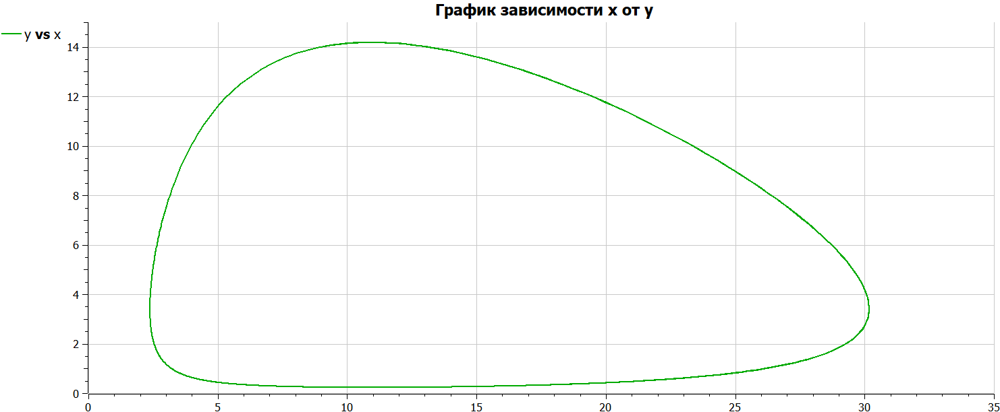
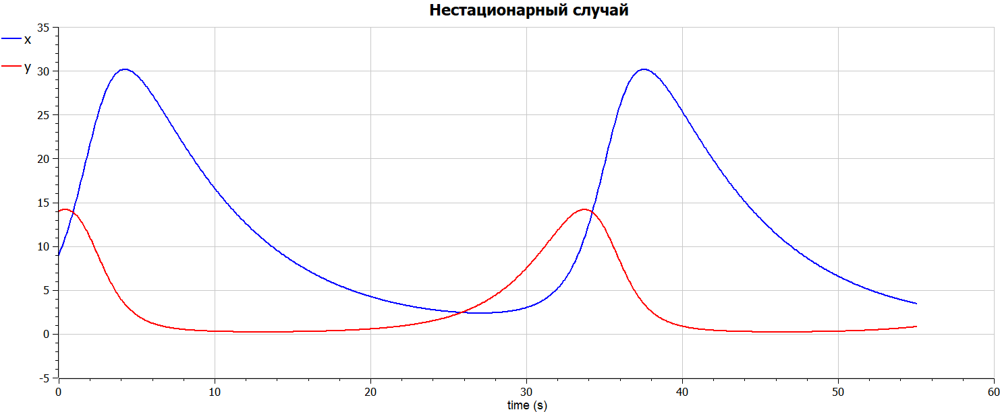
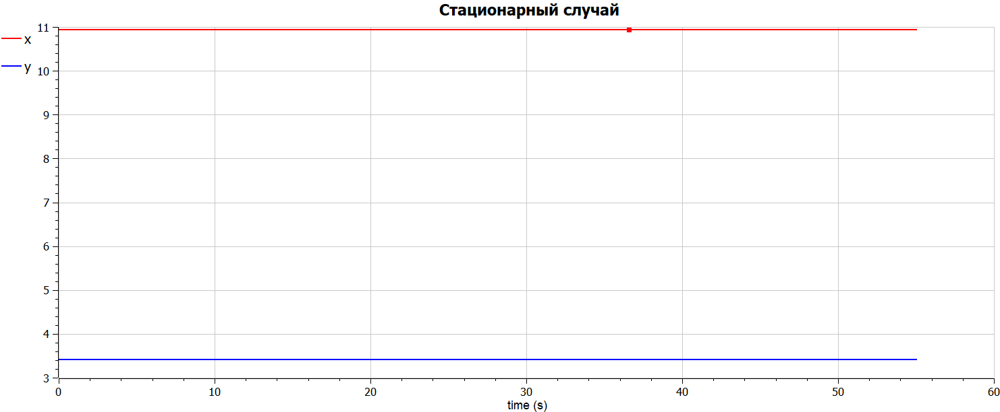
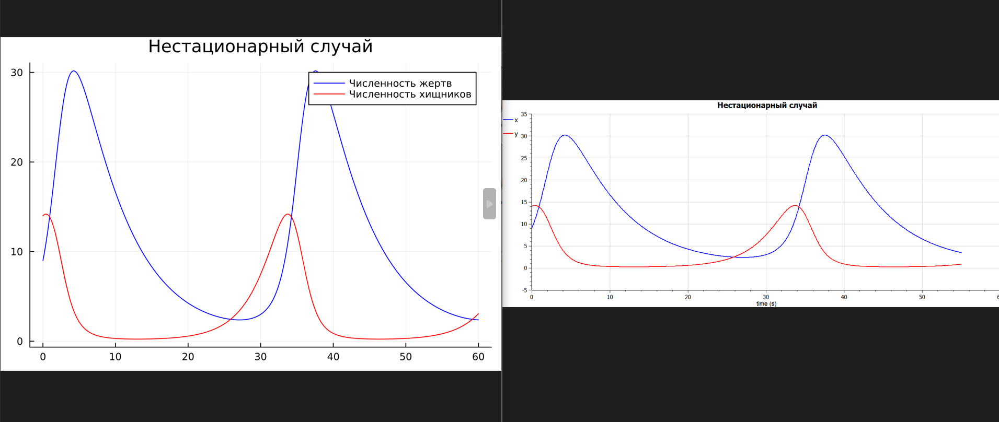
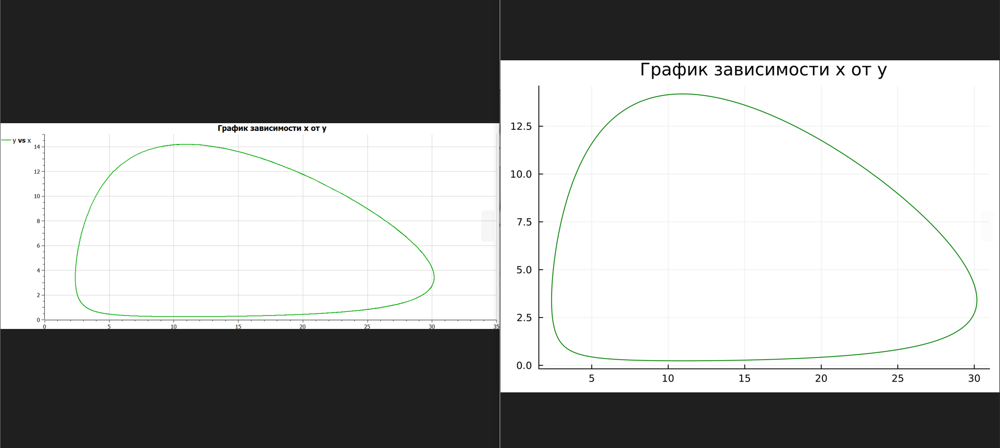
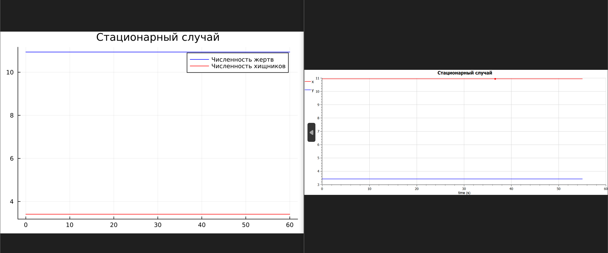

---
## Front matter
title: "Отчёт по лабораторной работе 5"
subtitle: "Модель хищник-жертва  "
author: "Аристова Арина Олеговна"

## Generic otions
lang: ru-RU
toc-title: "Содержание"

## Bibliography
bibliography: bib/cite.bib
csl: pandoc/csl/gost-r-7-0-5-2008-numeric.csl

## Pdf output format
toc: true # Table of contents
toc-depth: 2
lof: true # List of figures
lot: true # List of tables
fontsize: 12pt
linestretch: 1.5
papersize: a4
documentclass: scrreprt
## I18n polyglossia
polyglossia-lang:
  name: russian
  options:
	- spelling=modern
	- babelshorthands=true
polyglossia-otherlangs:
  name: english
## I18n babel
babel-lang: russian
babel-otherlangs: english
## Fonts
mainfont: PT Serif
romanfont: PT Serif
sansfont: PT Sans
monofont: PT Mono
mainfontoptions: Ligatures=TeX
romanfontoptions: Ligatures=TeX
sansfontoptions: Ligatures=TeX,Scale=MatchLowercase
monofontoptions: Scale=MatchLowercase,Scale=0.9
## Biblatex
biblatex: true
biblio-style: "gost-numeric"
biblatexoptions:
  - parentracker=true
  - backend=biber
  - hyperref=auto
  - language=auto
  - autolang=other*
  - citestyle=gost-numeric
## Pandoc-crossref LaTeX customization
figureTitle: "Рис."
tableTitle: "Таблица"
listingTitle: "Листинг"
lofTitle: "Список иллюстраций"
lotTitle: "Список таблиц"
lolTitle: "Листинги"
## Misc options
indent: true
header-includes:
  - \usepackage{indentfirst}
  - \usepackage{float} # keep figures where there are in the text
  - \floatplacement{figure}{H} # keep figures where there are in the text
---

# Цель работы

Цель:

- Изучить простейшую модель взаимодействия двух видов типа «хищник — жертва» - модель Лотки-Вольтерры. 

- Построить график зависимости x от y и графики функций $x(t), y(t)$ 

- Найти стационарное состояние системы


# Задание

## Вариант 4

Для модели «хищник-жертва»:

$$ \left\{ \begin{array}{cl}
{\frac{dx}{dt} = -0.15*x(t) + 0.044*x(t)*y(t) }\\
{\frac{dy}{dt} = 0.35*y(t) – 0.32*x(t)*y(t) }
\end{array} \right. $$

Построить график зависимости численности хищников от численности жертв, 
а также графики изменения численности хищников и численности жертв при 
следующих начальных условиях: $x_0 = 9, y_0 = 14$. Найти стационарное 
состояние системы. 

# Теоретическое введение


Julia – высокоуровневый язык, который разработан для научного программирования. Язык поддерживает широкий функционал для математических вычислений и работы с 
большими массивами данных[1]. 

OpenModelica — свободное открытое программное обеспечение для моделирования, симуляции, оптимизации и анализа сложных динамических систем. 
Основано на языке Modelica. Активно развивается Open Source Modelica Consortium, некоммерческой неправительственной организацией. Open Source Modelica 
Consortium является совместным проектом RISE SICS East AB и Линчёпингского университета. По своим возможностям приближается к таким вычислительным средам как 
Matlab Simulink, Scilab xCos, имея при этом значительно более удобное представление системы уравнений исследуемого блока [2].

- Модель Лотки—Вольтерры — модель взаимодействия двух видов типа «хищник — жертва», названная в честь её авторов, которые предложили модельные уравнения независимо друг от друга. Такие уравнения можно использовать для моделирования систем «хищник — жертва», «паразит — хозяин», конкуренции и других видов взаимодействия между двумя видами. [3]

Простейшая модель взаимодействия двух видов типа «хищник — жертва» - модель Лотки-Вольтерры. Данная двувидовая модель основывается на следующих предположениях: 

1. Численность популяции жертв x и хищников y зависят только от времени (модель не учитывает пространственное распределение популяции на занимаемой территории) 

2. В отсутствии взаимодействия численность видов изменяется по модели Мальтуса, при этом число жертв увеличивается, а число хищников падает 

3. Естественная смертность жертвы и естественная рождаемость хищника считаются несущественными 

4. Эффект насыщения численности обеих популяций не учитывается 

5. Скорость роста численности жертв уменьшается пропорционально численности хищников

$$ \left\{ \begin{array}{cl}
{\frac{dx}{dt} = a*x(t) – b*x(t)*y(t) }\\
{\frac{dy}{dt} = -c*y(t) + d*x(t)*y(t) }
\end{array} \right. $$

В этой модели x – число жертв, y - число хищников. Коэффициент a описывает скорость естественного прироста числа жертв в отсутствие хищников, с - естественное вымирание хищников, лишенных пищи в виде жертв. Вероятность взаимодействия жертвы и хищника считается пропорциональной как количеству жертв, так и числу самих хищников $(xy) $. Каждый акт взаимодействия уменьшает популяцию жертв, но способствует увеличению популяции хищников (члены $-bxy$ и $dxy$ в правой части уравнения).

Математический анализ этой (жесткой) модели показывает, что имеется стационарное состояние (A на рис. 3.1), всякое же другое начальное состояние (B) приводит к периодическому колебанию численности как жертв, так и хищников, так что по прошествии некоторого времени система возвращается в состояние B.

Стационарное состояние системы (положение равновесия, не зависящее от времени решение) будет в точке: $x_0 = c/d, y_0 = a/b$. Если начальные значения задать в стационарном состоянии x $x(0) = x_0, y_0$ , то в любой момент времени численность популяций изменяться не будет. При малом отклонении от положения равновесия численности как хищника, так и жертвы с течением времени не возвращаются к равновесным значениям, а совершают периодические колебания вокруг стационарной точки. Амплитуда колебаний и их период определяется начальными значениями численностей $x(0), y(0)$ . Колебания совершаются в противофазе[3,4].

При малом изменении модели

$$ \left\{ \begin{array}{cl}
{\frac{dx}{dt} = a*x(t) – b*x(t)*y(t) + \epsilon*f(x,y)}\\
{\frac{dy}{dt} = -c*y(t) + d*x(t)*y(t) + \epsilon*g(x,y), \epsilon << 1}
\end{array} \right. $$

(прибавление к правым частям малые члены, учитывающие, например, конкуренцию жертв за 
пищу и хищников за жертв), вывод о периодичности (возвращении системы в исходное 
состояние B), справедливый для жесткой системы Лотки-Вольтерры, теряет силу. Таким 
образом, мы получаем так называемую мягкую модель «хищник-жертва».

# Выполнение лабораторной работы

## Выполнение на Julia

Мой вариант лабораторной работы: 4. Я получила его по заданной формуле:

{#fig:001 width=70%}

Затем я написала 2 программы для каждого из случаев на языке Julia:

Вот листинг первой программы для **нестационарного** случая. Проблема заключается аналогично предыдущим лабораторным работам в решении одногодного дифференциального уравнения. Решение этой проблемы и отображается на графике. 

```julia
using Plots
using DifferentialEquations

x0 = 9
y0 = 14

a = 0.15
b = 0.044
c = 0.35
d = 0.032

function ode_fn(du, u, p, t)
    x, y = u
    du[1] = -a*u[1] + b * u[1] * u[2]
    du[2] = c * u[2] - d * u[1] * u[2]
end

v0 = [x0, y0]
tspan = (0.0, 60.0)
prob = ODEProblem(ode_fn, v0, tspan)
sol = solve(prob, dtmax=0.05)
X = [u[1] for u in sol.u]
Y = [u[2] for u in sol.u]
T = [t for t in sol.t]

plt1 = plot(dpi=300, legend=false)

plot!(plt1, title="График зависимости x от y")
plot!(plt1, X, Y, color=:green)

savefig(plt1, "lab5_1_1.png")

plt2 = plot(dpi=300, legend=true)

plot!(plt2, title="Нестационарный случай")
plot!(plt2, T, X, label="Численность жертв", color=:blue)

plot!( plt2, T, Y, label="Численность хищников", color=:red)

savefig(plt2, "lab5_1_2.png")
```

Полученный результат: 

- Первый график отражает $x(t),y(t)$:

{#fig:002 width=70%}

- Второй график отражает зависимость x от y:

{#fig:003 width=70%}

Вот листинг второй программы, который помог нам отыскать **стационароное состояние системы**:
Стационарное состояние системы (положение равновесия, не зависящее от времени решение) 
достигается в точке: $x_0 = c/d, y_0 = a/b$. 

```julia
using Plots
using DifferentialEquations

a = 0.15
b = 0.044
c = 0.35
d = 0.032

x0 = c / d
y0 = a / b

function ode_fn(du, u, p, t)
    x, y = u
    du[1] = -a*u[1] + b * u[1] * u[2]
    du[2] = c * u[2] - d * u[1] * u[2]
end

v0 = [x0, y0]
tspan = (0.0, 60.0)
prob = ODEProblem(ode_fn, v0, tspan)
sol = solve(prob, dtmax=0.05)
X = [u[1] for u in sol.u]
Y = [u[2] for u in sol.u]
T = [t for t in sol.t]

plt = plot(dpi=300, legend=true)

plot!(plt, title="Cтационарный случай")
plot!(plt, T, X, label="Численность жертв", color=:blue)

plot!( plt, T, Y, label="Численность хищников", color=:red)

savefig(plt, "lab5_2.png")
```

Полученный результат: 

{#fig:004 width=70%}


## Выполнение на Modelica

Затем я написала необходимые программы для каждого из случаев для получения решений на языке Modelica в OpenModelica:

Вот листинг первой программы для **нестационарного случая** случая:

```
model lab5_1

Real a = 0.15;
Real b = 0.044;
Real c = 0.35;
Real d = 0.032;

Real x;
Real y;

initial equation
x = 9;
y = 14;

equation
der(x) = -a*x + b*x*y;
der(y) = c*y - d*x*y;
end lab5_1;
```

Полученный результат: 

- Первый график отражает зависимость $x(t),y(t)$:

{#fig:005 width=70%}

- Второй график отражает зависимость x от y:

{#fig:006 width=70%}

Вот листинг второй программы, который помог нам отыскать **стационароное состояние системы**:
Стационарное состояние системы (положение равновесия, не зависящее от времени решение) 
достигается в точке: $x_0 = c/d, y_0 = a/b$.

```
model lab5_2

Real a = 0.15;
Real b = 0.044;
Real c = 0.35;
Real d = 0.032;

Real x;
Real y;

initial equation
x = c / d;
y = a / b;

equation
der(x) = -a*x + b*x*y;
der(y) = c*y - d*x*y;
end lab5_2;
```

Полученный результат: 

{#fig:007 width=70%}

# Анализ полученных результатов 

В итоге проделанной работы мною были построены все необходимые графики: 
график зависимости численности хищников от численности жертв, графики 
изменения численности хищников и численности жертв на языках Julia и OpenModelica. 
Аналогично предыдущим лабораторным работам, код для построения модели хищник-жертва на 
языке Modelica занимает меньше строк, нежели аналогичное построение на Julia.

Также немаловажно, что на обоих языках содержание графиков получилось идентичным:

{#fig:008 width=70%}

{#fig:009 width=70%}

{#fig:010 width=70%}

# Выводы

В ходе и по результатам выполнения лабораторной работы я построила необходимые графики (два описывающие нестационарный случай и зависимость количества жертв от количества хищников, и описывающий стационарный случай) на двух языках: Julia и Modelica.

# Список литературы. Библиография {.unnumbered}

[1] Документация по Julia: https://docs.julialang.org/en/v1/ 

[2] Документация по OpenModelica: https://openmodelica.org/  

[3] Модель Лотки – Вольтерры https://ru.wikipedia.org/wiki/%D0%9C%D0%BE%D0%B4%D0%B5%D0%BB%D1%8C_%D0%9B%D0%BE%D1%82%D0%BA%D0%B8_%E2%80%94_%D0%92%D0%BE%D0%BB%D1%8C%D1%82%D0%B5%D1%80%D1%80%D1%8B

[4] Материалы к лабораторной работе 
