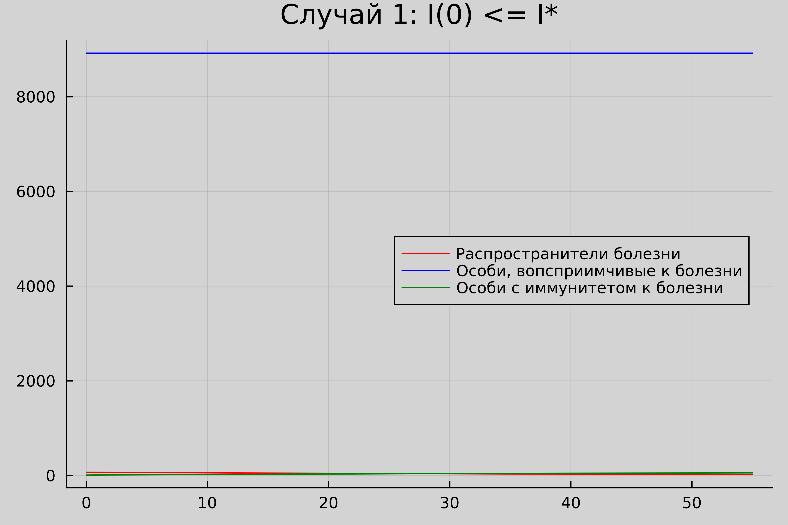
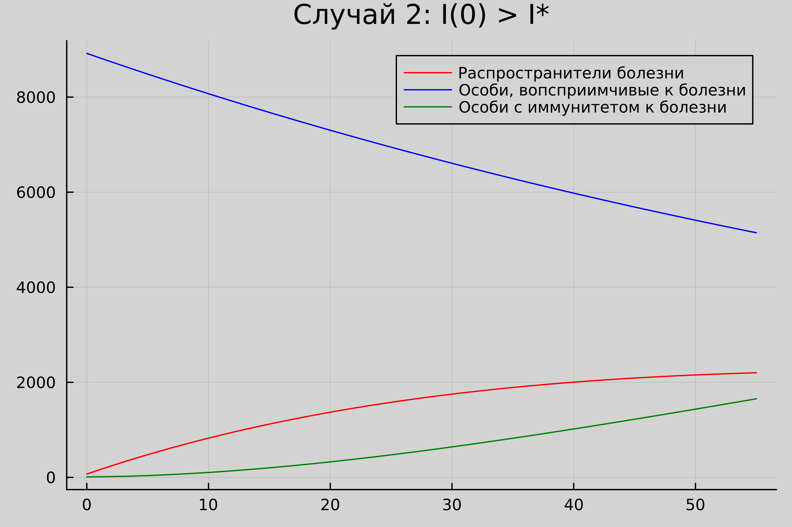
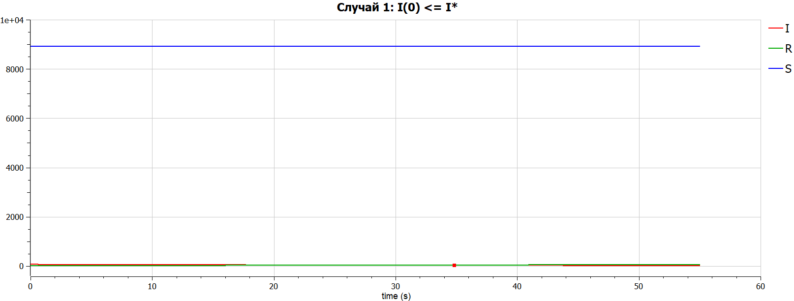
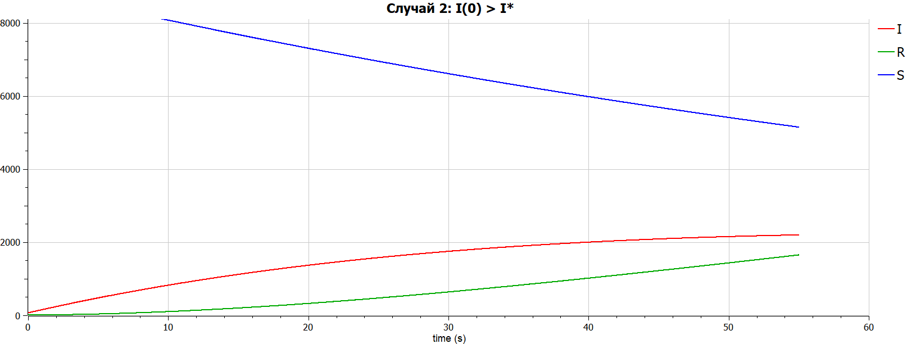
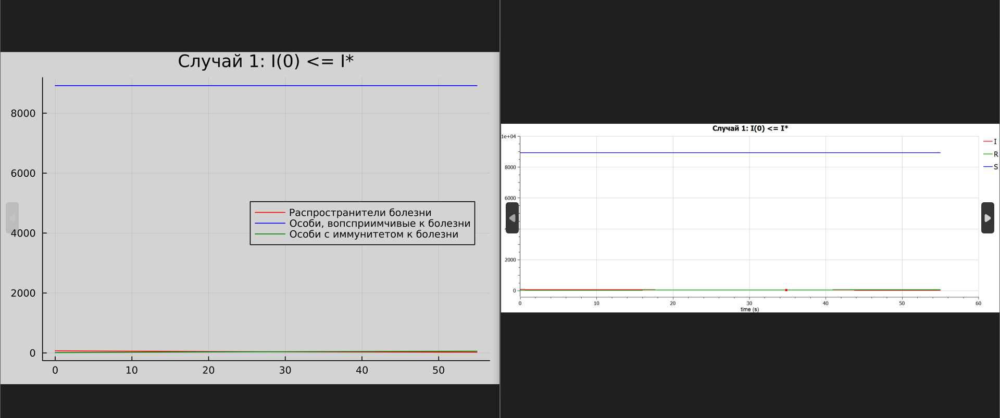
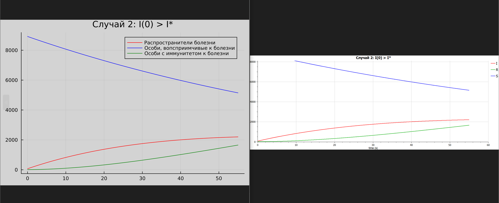

---
## Front matter
lang: ru-RU
title: Презентация к лабораторной работе 6
subtitle: Задача об эпидемии 
author:
  - Аристова А.О.
institute:
  - Российский университет дружбы народов, Москва, Россия
date: 08 марта 2024

## i18n babel
babel-lang: russian
babel-otherlangs: english

## Formatting pdf
toc: false
toc-title: Содержание
slide_level: 2
aspectratio: 169
section-titles: true
theme: metropolis
header-includes:
 - \metroset{progressbar=frametitle,sectionpage=progressbar,numbering=fraction}
 - '\makeatletter'
 - '\beamer@ignorenonframefalse'
 - '\makeatother'
---

# Информация

## Докладчик

:::::::::::::: {.columns align=center}
::: {.column width="70%"}

  * Аристова Арина Олеговна
  * студентка группы НФбд-01-21
  * Российский университет дружбы народов
  * [1032216433@rudn.ru](mailto:1032216433@rudn.ru)
  * <https://github.com/aoaristova>

:::
::: {.column width="30%"}


:::
::::::::::::::

# Вводная часть

## Цели работы


Рассмотреть простейшую модель эпидемии, 
построить ее для двух случаев на языках Julia и Modelica.

## Задание 

**Вариант 4**

На одном острове вспыхнула эпидемия. Известно, что из всех проживающих 
на острове $(N=9000)$ в момент начала эпидемии $(t=0)$ число заболевших людей 
(являющихся распространителями инфекции) $I(0)=70$, А число здоровых людей с 
иммунитетом к болезни $R(0)=10$. Таким образом, число людей восприимчивых к 
болезни, но пока здоровых, в начальный момент времени $S(0)=N-I(0)- R(0)$.

Построить графики изменения числа особей в каждой из трех групп. 
Рассмотреть, как будет протекать эпидемия в случае: 

1. если $I(0) <= I*$
2. если $I(0) > I*$

# Теоретическое введение

## О языках программирования 

Julia – высокоуровневый язык, который разработан для научного программирования. Язык поддерживает широкий функционал для математических вычислений и работы с 
большими массивами данных[1]. 

OpenModelica — свободное открытое программное обеспечение для моделирования, симуляции, оптимизации и анализа сложных динамических систем. 
Основано на языке Modelica. Активно развивается Open Source Modelica Consortium, некоммерческой неправительственной организацией. Open Source Modelica 
Consortium является совместным проектом RISE SICS East AB и Линчёпингского университета. По своим возможностям приближается к таким вычислительным средам как 
Matlab Simulink, Scilab xCos, имея при этом значительно более удобное представление системы уравнений исследуемого блока [2].

## Задача об эпидемии

Рассмотрим простейшую модель эпидемии. Предположим, что некая 
популяция, состоящая из $N$ особей, (считаем, что популяция изолирована) 
подразделяется на три группы. Первая группа - это восприимчивые к болезни, но 
пока здоровые особи, обозначим их через $S(t)$. Вторая группа – это число 
инфицированных особей, которые также при этом являются распространителями 
инфекции, обозначим их $I(t)$. А третья группа, обозначающаяся через $R(t)$ – это 
здоровые особи с иммунитетом к болезни[3,4].

До того, как число заболевших не превышает критического значения 
I*, считаем, что все больные изолированы и не заражают здоровых. Когда $I(t) > I*$, 
тогда инфицирование способны заражать восприимчивых к болезни особей.

## Задача об эпидемии

Таким образом, скорость изменения числа $S(t)$ меняется по следующему 
закону:

$$ \frac{dS}{dt} = 
    \begin{cases}
        -\alpha S &\text{,если $I(t) > I^*$}
        \\
        0 &\text{,если $I(t) \leq I^*$}
    \end{cases}
$$

## Задача об эпидемии

Поскольку каждая восприимчивая к болезни особь, которая, в конце концов, 
заболевает, сама становится инфекционной, то скорость изменения числа 
инфекционных особей представляет разность за единицу времени между 
заразившимися и теми, кто уже болеет и лечится, т.е.:

$$ \frac{dI}{dt} = 
    \begin{cases}
        -\alpha S - \beta I &\text{,если $I(t) > I^*$}
        \\
         - \beta I &\text{,если $I(t) \leq I^*$}
    \end{cases}
$$

## Задача об эпидемии

А скорость изменения выздоравливающих особей (при этом приобретающие 
иммунитет к болезни)

$$ \frac{dI}{dt} = \beta I $$

Постоянные пропорциональности $\alpha, \beta$, - это коэффициенты заболеваемости 
и выздоровления соответственно.

## Задача об эпидемии

Для того, чтобы решения соответствующих уравнений определялось 
однозначно, необходимо задать начальные условия .Считаем, что на начало 
эпидемии в момент времени $t = 0$ нет особей с иммунитетом к болезни $R(0)=0$, а 
число инфицированных и восприимчивых к болезни особей 
$I(0)$ и $S(0)$ соответственно. Для анализа картины протекания эпидемии необходимо 
рассмотреть два случая: $I(0) \leq I^*$ и $I(0) > I^*$
[4]

# Выполнение лабораторной работы

## Определение варианта

Мой вариант лабораторной работы: 4. Я получила его по заданной формуле:

{#fig:001 width=70%}

## Выполнение на Julia

Затем я написала 2 программы для каждого из случаев на языке Julia:

Вот листинг первой программы для cлучая **$I(0) \leq I^*$**. Проблема заключается аналогично предыдущим лабораторным работам в решении одногодного дифференциального уравнения. Решение этой проблемы и отображается на графике. 

## Выполнение на Julia

```julia
using Plots
using DifferentialEquations

N = 9000 	# проживающих на острове
I0 = 70 	# число заболевших, являющихся распространителями инфекции
R0 = 10 	# здоровых людей с иммунитетом к болезни
S0 = N - I0 - R0 	# число людей восприимчивых к болезни, но пока здоровых, в начальный момент времени

a = 0.01 	# коэффициент заболеваемости 
b = 0.02	# коэффициент выздоравения 
```

## Выполнение на Julia

```julia
# I(0) <= I*

function func(du, u, p, t)
	S,I,R = u
	du[1] = 0
	du[2] = -b*u[2]
	du[3] = b*u[2]
end
```

## Выполнение на Julia

```julia
v0 = [S0, I0, R0]
tspan  = (0.0,55.0)
problem = ODEProblem(func, v0, tspan)
solution = solve(problem, dtmax=0.05)
S=[u[1] for u in solution.u]
I=[u[2] for u in solution.u]
R=[u[3] for u in solution.u]
T=[t for t in solution.t]
```

## Выполнение на Julia

```julia
plt = plot(dpi=700, bg=:lightgrey, legend=true)
plot!(plt, title=:"Случай 1: I(0) <= I*", legend=:right)
plot!(plt, T, I, label="Распространители болезни", color=:red)
plot!(plt, T, S, label="Особи, вопсприимчивые к болезни", color=:blue)
plot!(plt, T, R, label="Особи с иммунитетом к болезни", color=:green)

savefig(plt, "lab6_1.png")
```

## Выполнение на Julia

**Полученный результат:** 

На графиках отражена зависимость трех групп: 
инфицированных особей, рискующих заразиться особей и имеющих иммунитет особей.

{#fig:002 width=45%}

## Выполнение на Julia

Вот листинг второй программы для cлучая **$I(0) > I^*$**.


```julia
using Plots
using DifferentialEquations

N = 9000 	# проживающих на острове
I0 = 70 	# число заболевших, являющихся распространителями инфекции
R0 = 10 	# здоровых людей с иммунитетом к болезни
S0 = N - I0 - R0 	# число людей восприимчивых к болезни, но пока здоровых, в начальный момент времени

a = 0.01 	# коэффициент заболеваемости 
b = 0.02	# коэффициент выздоравения 
```

## Выполнение на Julia

```julia
# I(0) > I*
function func(du, u, p, t)
	S,I,R = u
	du[1] = -a*u[1]
	du[2] = a*u[1]-b*u[2]
	du[3] = b*u[2]
end

```

## Выполнение на Julia 

```julia
v0 = [S0, I0, R0]
tspan  = (0.0,55.0)
problem = ODEProblem(func, v0, tspan)
solution = solve(problem, dtmax=0.05)
S=[u[1] for u in solution.u]
I=[u[2] for u in solution.u]
R=[u[3] for u in solution.u]
T=[t for t in solution.t]
```

## Выполнение на Julia 

```julia
plt = plot(dpi=700, bg=:lightgrey, legend=true)
plot!(plt, title=:"Случай 2: I(0) > I*", legend=:best)
plot!(plt, T, I, label="Распространители болезни", color=:red)
plot!(plt, T, S, label="Особи, вопсприимчивые к болезни", color=:blue)
plot!(plt, T, R, label="Особи с иммунитетом к болезни", color=:green)

savefig(plt, "lab6_2.png")
```

## Выполнение на Julia

**Полученный результат:** 

На графиках отражена зависимость трех групп: 
инфицированных особей, рискующих заразиться особей и имеющих иммунитет особей.

{#fig:004 width=45%}

## Выполнение на Modelica

Затем я написала необходимые программы для каждого из случаев для получения решений на языке 
Modelica в OpenModelica:

Вот листинг первой программы для cлучая **$I(0) \leq I^*$**. 
Проблема заключается аналогично предыдущим лабораторным работам в решении одногодного дифференциального 
уравнения. Решение этой проблемы и отображается на графике.

## Выполнение на Modelica

```
model lab6_1
Real N = 9000;
Real S;
Real I;
Real R;

Real a = 0.01;
Real b = 0.02;
```

## Выполнение на Modelica

```
initial equation
I = 70;
R = 10;
S = N - I - R;

equation
der(S) = 0;
der(I) = -b*I;
der(R) = b*I;
end lab6_1;
```

## Выполнение на Modelica

**Полученный результат:** 

На графиках отражена зависимость трех групп: 
инфицированных особей, рискующих заразиться особей и имеющих иммунитет особей.

{#fig:005 width=70%}

## Выполнение на Modelica

**Полученный результат:** 

На графиках отражена зависимость трех групп: 
инфицированных особей, рискующих заразиться особей и имеющих иммунитет особей.

{#fig:005 width=70%}

## Выполнение на Modelica

Вот листинг второй программыдля cлучая **$I(0) > I^*$**.

```
model lab6_2
Real N = 9000;
Real S;
Real I;
Real R;

Real a = 0.01;
Real b = 0.02;
```

## Выполнение на Modelica

```
initial equation
I = 70;
R = 10;
S = N - I - R;

equation
der(S) = -a*S;
der(I) = a*S-b*I;
der(R) = b*I;
end lab6_2;
```

## Выполнение на Modelica

**Полученный результат:** 

На графиках отражена зависимость трех групп: 
инфицированных особей, рискующих заразиться особей и имеющих иммунитет особей.

{#fig:007 width=70%}


# Выводы

## Анализ полученных результатов 

В результате проделанной мною работы, были получены графики моделей эпидемии для различных случаев, на графиках отражена зависимость трех групп: инфицированных особей, рискующих заразиться особей и имеющих иммунитет особей.

Если говорить о сравнении языков, то можно отметить, что построение модели эпидемии на Modelica требует использования меньшего количества строк, чем аналогичное построение на Julia. Это происходит потому, что построение на Modelica происходит как раз относительно времени, что и говорит нам о том, что Modelica именно предназначена для подобных задач.

Так же можно отметить, что построенные на двух языках графики получились аналогичными по содержанию, что сигнализирует о корректности исполнения.


## Анализ полученных результатов 

{#fig:008 width=80%}

## Анализ полученных результатов 

{#fig:009 width=80%}

## Вывод

В ходе и по результатам выполнения лабораторной работы мною была изучена и построена простейшая модель эпидемии на двух языках: Julia и Modelica.

## Список литературы. Библиография {.unnumbered}

[1] Документация по Julia: https://docs.julialang.org/en/v1/ 

[2] Документация по OpenModelica: https://openmodelica.org/  

[3] Простейшая модель эпидемии: https://studfile.net/preview/5845326/page:13/

[4] Материалы к лабораторной работе 
