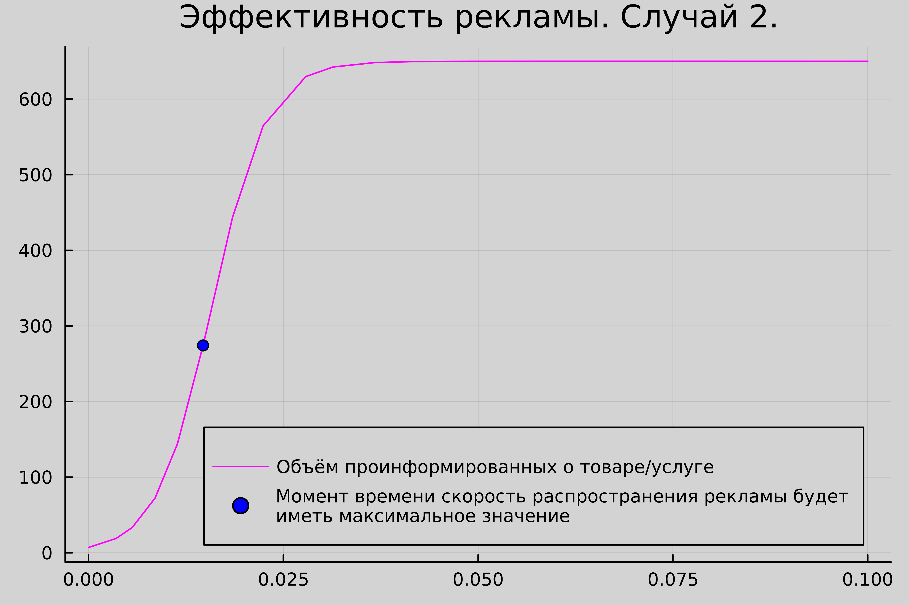

---
## Front matter
title: "Отчёт по лабораторной работе 7"
subtitle: "Эффективность рекламы"
author: "Аристова Арина Олеговна"

## Generic otions
lang: ru-RU
toc-title: "Содержание"

## Bibliography
bibliography: bib/cite.bib
csl: pandoc/csl/gost-r-7-0-5-2008-numeric.csl

## Pdf output format
toc: true # Table of contents
toc-depth: 2
lof: true # List of figures
lot: true # List of tables
fontsize: 12pt
linestretch: 1.5
papersize: a4
documentclass: scrreprt
## I18n polyglossia
polyglossia-lang:
  name: russian
  options:
	- spelling=modern
	- babelshorthands=true
polyglossia-otherlangs:
  name: english
## I18n babel
babel-lang: russian
babel-otherlangs: english
## Fonts
mainfont: PT Serif
romanfont: PT Serif
sansfont: PT Sans
monofont: PT Mono
mainfontoptions: Ligatures=TeX
romanfontoptions: Ligatures=TeX
sansfontoptions: Ligatures=TeX,Scale=MatchLowercase
monofontoptions: Scale=MatchLowercase,Scale=0.9
## Biblatex
biblatex: true
biblio-style: "gost-numeric"
biblatexoptions:
  - parentracker=true
  - backend=biber
  - hyperref=auto
  - language=auto
  - autolang=other*
  - citestyle=gost-numeric
## Pandoc-crossref LaTeX customization
figureTitle: "Рис."
tableTitle: "Таблица"
listingTitle: "Листинг"
lofTitle: "Список иллюстраций"
lotTitle: "Список таблиц"
lolTitle: "Листинги"
## Misc options
indent: true
header-includes:
  - \usepackage{indentfirst}
  - \usepackage{float} # keep figures where there are in the text
  - \floatplacement{figure}{H} # keep figures where there are in the text
---

# Цель работы

Изучить моделирование эффективности рекламы, построить несколько графиков моделей в соответствии с заданием, 
а также в одном из графиков отметить точку, в которой скорость распространения рекламы наибольшая.

# Задание

## Вариант 4

Построить график распространения рекламы, математическая модель которой описывается 
следующим уравнением:

1. $\frac{dn}{dt} = (0.44 + 0.0021n(t))(N - n(t)$

2. $\frac{dn}{dt} = (0.00009 + 0.44n(t))(N - n(t)$

3. $\frac{dn}{dt} = (0.77t + 0.5cos(t)n(t))(N - n(t)$


При этом объем аудитории $N = 650$, в начальный момент о товаре знает 7 человек. Для 
случая 2 определите в какой момент времени скорость распространения рекламы будет 
иметь максимальное значение.

# Теоретическое введение

## Справка о языках программирования 

Julia – высокоуровневый язык, который разработан для научного программирования. Язык поддерживает широкий функционал для математических вычислений и работы с 
большими массивами данных[1]. 

OpenModelica — свободное открытое программное обеспечение для моделирования, симуляции, оптимизации и анализа сложных динамических систем. 
Основано на языке Modelica. Активно развивается Open Source Modelica Consortium, некоммерческой неправительственной организацией. Open Source Modelica 
Consortium является совместным проектом RISE SICS East AB и Линчёпингского университета. По своим возможностям приближается к таким вычислительным средам как 
Matlab Simulink, Scilab xCos, имея при этом значительно более удобное представление системы уравнений исследуемого блока [2].

## Эффективность рекламы

Организуется рекламная кампания нового товара или услуги. Необходимо, 
чтобы прибыль будущих продаж с избытком покрывала издержки на рекламу. 
Вначале расходы могут превышать прибыль, поскольку лишь малая часть 
потенциальных покупателей будет информирована о новинке. Затем, при 
увеличении числа продаж, возрастает и прибыль, и, наконец, наступит момент, 
когда рынок насытиться, и рекламировать товар станет бесполезным.

Предположим, что торговыми учреждениями реализуется некоторая 
продукция, о которой в момент времени 
$t$ из числа потенциальных покупателей $N$ знает лишь $n$
покупателей. Для ускорения сбыта продукции запускается реклама 
по радио, телевидению и других средств массовой информации. После запуска 
рекламной кампании информация о продукции начнет распространяться среди 
потенциальных покупателей путем общения друг с другом. Таким образом, после 
запуска рекламных объявлений скорость изменения числа знающих о продукции 
людей пропорциональна как числу знающих о товаре покупателей, так и числу 
покупателей о нем не знающиx[3,4].

Модель рекламной кампании описывается следующими величинами. 
Считаем, что $dn/dt$ - скорость изменения со временем числа потребителей, 
узнавших о товаре и готовых его купить, 
$t$ - время, прошедшее с начала рекламной кампании, 
$n(t)$ - число уже информированных клиентов. Эта величина 
пропорциональна числу покупателей, еще не знающих о нем, это описывается 
следующим образом: 
$\alpha _1(t)(N-n(t)$ , где N - общее число потенциальных платежеспособных покупателей, 
$\alpha _1(t) > 0$ - характеризует интенсивность рекламной кампании (зависит от затрат на рекламу в данный момент времени). 
Помимо этого, узнавшие о товаре потребители также распространяют полученную 
информацию среди потенциальных покупателей, не знающих о нем (в этом случае 
работает т.н. сарафанное радио). Этот вклад в рекламу описывается величиной 
$\alpha _2(t)n(t)(N-n(t))$, эта величина увеличивается с увеличением потребителей 
узнавших о товаре. Математическая модель распространения рекламы описывается 
уравнением[4]:

$$ \frac{dn}{dt} = (\alpha _1(t) - \alpha _2(t)n(t))(N - n(t)$$

При $\alpha _1(t) >> \alpha _2(t)$ получается модель типа модели Мальтуса, решение которой 
имеет вид:

{#fig:001 width=70%}

В обратном случае, при $\alpha _1(t) << \alpha _2(t)$получаем уравнение логистической кривой:

{#fig:002 width=70%}

# Выполнение лабораторной работы

## Выполнение на Julia

Мой вариант лабораторной работы: 4. Я получила его по заданной формуле:

{#fig:003 width=70%}

Затем я написала 3 программы для каждого из случаев на языке Julia:

Вот листинг первой программы для случая $\frac{dn}{dt} = (0.44 + 0.0021n(t))(N - n(t)$:

```julia
using Plots
using DifferentialEquations

N = 650
n0 = 7

function func(du, u, p, t)
	n = u
	du[1] = (0.44 + 0.0021 * u[1])*(N - u[1])
end

v0=[n0]
tspan=(0.0, 5.0)
problem = ODEProblem(func, v0, tspan)
solution = solve(problem, dtmax=0.05)

n = [u[1] for u in solution.u]
T = [t for t in solution.t]

plt = plot(dpi=700, title="Эффективность рекламы. Случай 1.",bg=:lightgrey, legend=:bottomright)
plot!(plt, T, n, color=:deeppink, label="Объём проинформированных о товаре/услуге")

savefig(plt, "lab7_1.png")
```


**Полученный результат:**

{#fig:004 width=70%}

Вот листинг второй программы для случая $\frac{dn}{dt} = (0.00009 + 0.44n(t))(N - n(t)$:

```julia
using Plots
using DifferentialEquations

N = 650
n0 = 7

function func(du, u, p, t)
	(n) = u
	du[1] = (0.00009 + 0.44 * u[1])*(N - u[1])
end

v0=[n0]
tspan=(0.0, 0.10)
problem = ODEProblem(func, v0, tspan)
solution = solve(problem, dtmax=0.05)

n = [u[1] for u in solution.u]
T = [t for t in solution.t]


max_n = 0;
max_n_t = 0;
max_n_n = 0;
for (i, t) in enumerate(T)
    if solution(t, Val{1})[1] > max_n
        global max_n = solution(t, Val{1})[1]
        global max_n_t = t
        global max_n_n = n[i]
    end
end


plt = plot(dpi=700, title="Эффективность рекламы. Случай 2.",bg=:lightgrey, legend=true)
plot!(plt, T, n, color=:magenta, label="Объём проинформированных о товаре/услуге")
plot!(plt, [max_n_t], [max_n_n], seriestype = :scatter, color=:blue, label = "Момент времени скорость распространения рекламы будет 
иметь максимальное значение" )

savefig(plt, "lab7_2.png")
```


**Полученный результат: **

{#fig:05 width=70%}

Вот листинг третьей программы для случая $\frac{dn}{dt} = (0.77t + 0.5cos(t)n(t))(N - n(t)$:

```julia
using Plots
using DifferentialEquations

N = 650
n0 = 7

function func(du, u, p, t)
	n = u
	du[1] = (0.77*t + 0.5 * cos(t)* u[1])*(N - u[1])
end

v0=[n0]
tspan=(0.0, 0.10)
problem = ODEProblem(func, v0, tspan)
solution = solve(problem, dtmax=0.05)

n = [u[1] for u in solution.u]
T = [t for t in solution.t]

plt = plot(dpi=700, title="Эффективность рекламы. Случай 3.",bg=:lightgrey, legend=true)
plot!(plt, T, n, color=:purple, label="Объём проинформированных о товаре/услуге")

savefig(plt, "lab7_3.png")
```


**Полученный результат: **

{#fig:006 width=70%}

## Выполнение на Modelica

Затем я написала необходимые программы для каждого из случаев для получения решений на языке Modelica в OpenModelica:

Вот листинг первой программы для для случая $\frac{dn}{dt} = (0.44 + 0.0021n(t))(N - n(t)$:

```
model lab7_1

Real N = 650;
Real n;

initial equation
n = 7;

equation
der(n) = (0.44 + 0.0021*n) * (N-n);
end lab7_1;

```

**Полученный результат: **

{#fig:007width=70%}

Вот листинг второй программы для случая $\frac{dn}{dt} = (0.00009 + 0.44n(t))(N - n(t)$:

```
model lab7_2

Real N = 650;
Real n;

initial equation
n = 7;

equation
der(n) = (0.00009 + 0.44*n)*(N-n);
end lab7_2;
```


**Полученный результат:** 

{#fig:008 width=70%}

Вот листинг третьей программы для случая $\frac{dn}{dt} = (0.77t + 0.5cos(t)n(t))(N - n(t)$:

```
model lab7_3

Real N = 650;
Real n;

initial equation
n = 7;

equation
der(n) = (0.77*time + 0.5 * cos(time)*n)*(N-n);

end lab7_3;
```

**Полученный результат:** 

{#fig:009 width=70%}

# Анализ полученных результатов 

В результате проделанной мною работы, были получены графики моделей распространения рекламы для различных случаев, а также на одном из них найдена точка с наибольшей скоростью распространения.

Если говорить о сравнении языков, то можно отметить, что построение модели эпидемии на Modelica требует использования меньшего количества строк, чем аналогичное построение на Julia. Это происходит потому, что построение на Modelica происходит как раз относительно времени, что и говорит нам о том, что Modelica именно предназначена для подобных задач.

Так же можно отметить, что построенные на двух языках графики получились аналогичными по содержанию, что сигнализирует о корректности исполнения.

{#fig:010 width=70%}

{#fig:011 width=70%}

{#fig:012 width=70%}

# Вывод

В ходе и по результатам выполнения лабораторной работы мною была изучена и построена модель эффективности рекламы на двух языках: Julia и Modelica.

# Список литературы. Библиография {.unnumbered}

[1] Документация по Julia: https://docs.julialang.org/en/v1/ 

[2] Документация по OpenModelica: https://openmodelica.org/  

[3] Модель Мальтуса: https://studfile.net/preview/6131259/page:16/

[4] Материалы к лабораторной работе 
