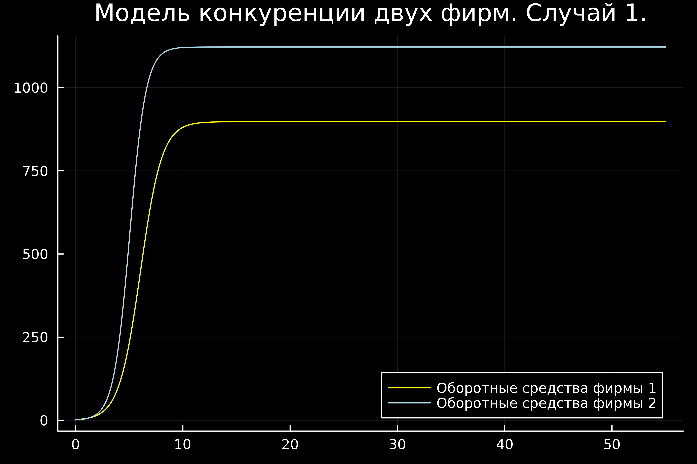
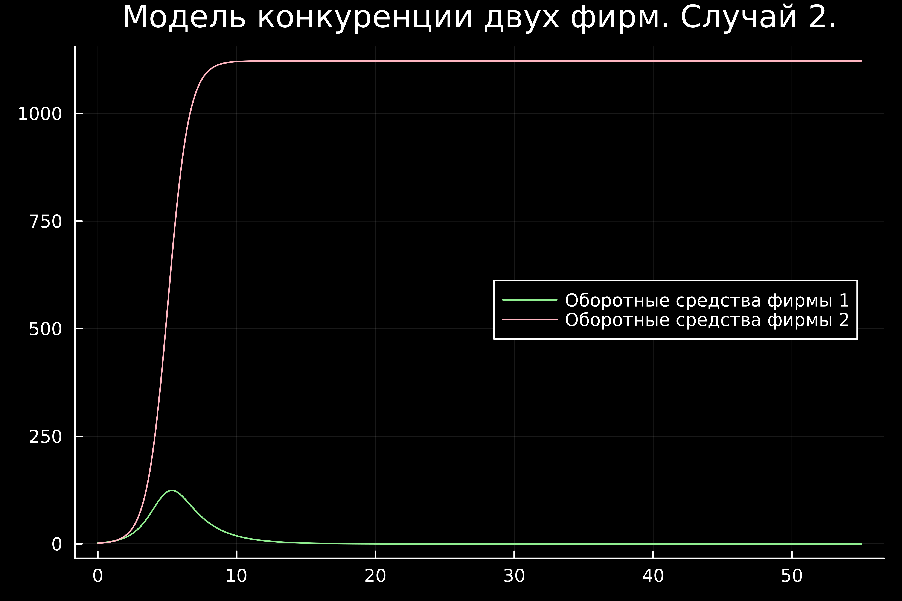
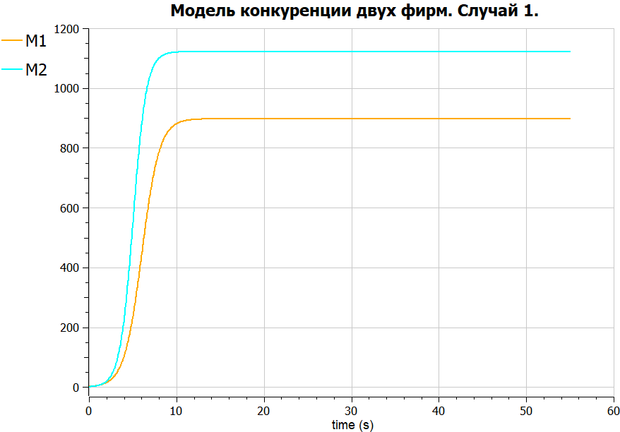
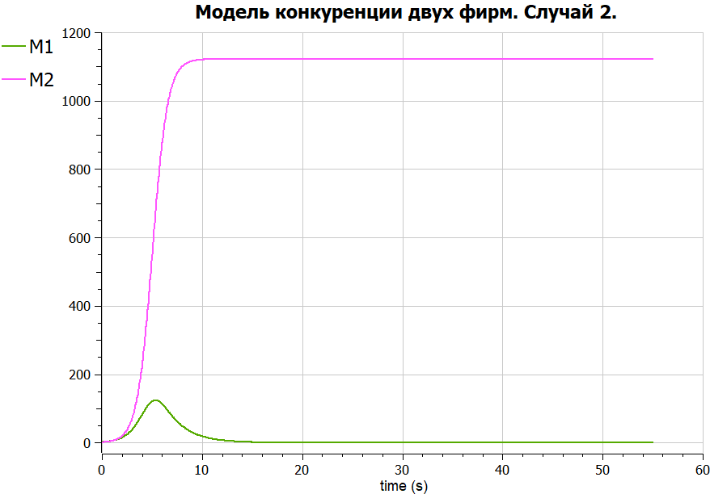
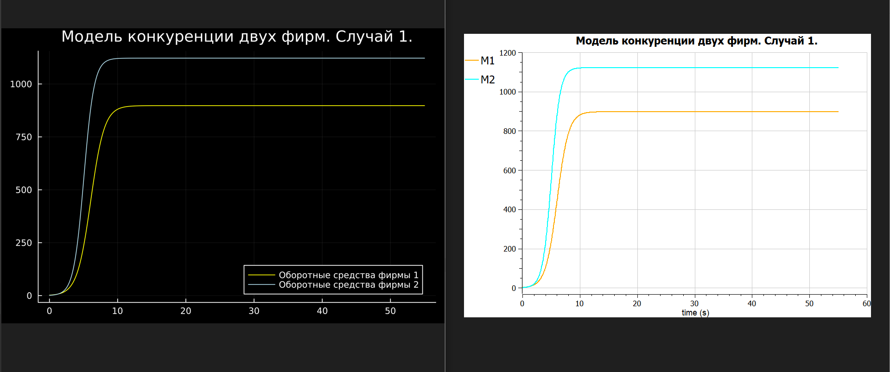
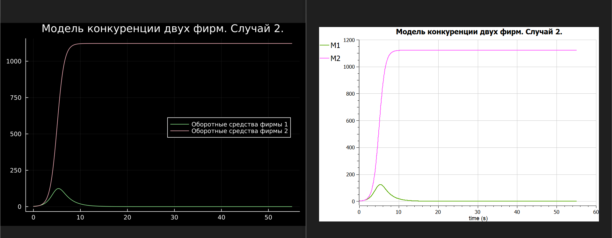

---
## Front matter
lang: ru-RU
title: Презентация к лабораторной работе 8
subtitle: Модель конкуренции двух фирм
author:
  - Аристова А.О.
institute:
  - Российский университет дружбы народов, Москва, Россия
date: 12 марта 2024

## i18n babel
babel-lang: russian
babel-otherlangs: english

## Formatting pdf
toc: false
toc-title: Содержание
slide_level: 2
aspectratio: 169
section-titles: true
theme: metropolis
header-includes:
 - \metroset{progressbar=frametitle,sectionpage=progressbar,numbering=fraction}
 - '\makeatletter'
 - '\beamer@ignorenonframefalse'
 - '\makeatother'
---

# Информация

## Докладчик

:::::::::::::: {.columns align=center}
::: {.column width="70%"}

  * Аристова Арина Олеговна
  * студентка группы НФбд-01-21
  * Российский университет дружбы народов
  * [1032216433@rudn.ru](mailto:1032216433@rudn.ru)
  * <https://github.com/aoaristova>

:::
::: {.column width="30%"}


:::
::::::::::::::

# Вводная часть

## Цель работы

Изучить и смоделировать конкуренцию двух фирм для двух случаев на двух языках: Julia и Modelica.

# Задание 

## Вариант 4

>**Случай 1** 

Рассмотрим две фирмы, производящие взаимозаменяемые товары одинакового качества и находящиеся в 
одной рыночной нише. Считаем, что в рамках нашей модели конкурентная борьба ведётся только рыночными 
методами. То есть, конкуренты могут влиять на противника путем изменения параметров своего 
производства: себестоимость, время цикла, но не могут прямо вмешиваться в ситуацию на рынке 
(«назначать» цену или влиять на потребителей каким-либо иным способом.) Будем считать, 
что постоянные издержки пренебрежимо малы, и в модели учитывать не будем. В этом случае динамика 
изменения объемов продаж фирмы 1 и фирмы 2 описывается следующей системой уравнений:

## Вариант 4

$$\frac{dM_1}{d\Theta} = M_1 - \frac{b}{c_1}M_1 M_2 - \frac{a1}{c1} M_1^2 $$

$$ \frac{dM_2}{d\Theta} = \frac{c_2}{c_1} M_2 - \frac{b}{c_1} M_1 M_2 - \frac{a_2}{c_1} M_2^2$$

## Вариант 4

где 

$$ a_1 = \frac{p_{cr}}{\tau_1^2 \widetilde{p}_1^2 Nq } $$
$$ a_2 = \frac{p_{cr}}{\tau_2^2 \widetilde{p}_2^2 Nq } $$ 
$$ b = \frac{p_{cr}}{\tau_1^2 \widetilde{p}_1^2 \tau_2^2 \widetilde{p}_2^2 Nq} $$
$$ c_1 = \frac{p_{cr} - \widetilde{p}_1}{\tau_1 \widetilde{p}_1} $$
$$ c_2 = \frac{p_{cr} - \widetilde{p}_2}{\tau_2 \widetilde{p}_2} $$

также введена нормировка $t = c_1 \theta$

## Вариант 4

>**Случай 2** 

Рассмотрим модель, когда, помимо экономического фактора влияния используются еще и социально-психологические 
факторы. В этом случае взаимодействие двух фирм будет зависеть друг от друга, соответственно коэффициент
перед $M_1 M_2$ будет отличаться. Пусть в рамках рассматриваемой модели динамика изменения объемов 
продаж фирмы 1 и фирмы 2 описывается следующей системой уравнений:

$$\frac{dM_1}{d\theta} = M_1 - (\frac{b}{c_1} + 0.0013)M_1 M_2 - \frac{a1}{c1} M_1^2 $$

$$ \frac{dM_2}{d\theta} = \frac{c_2}{c_1} M_2 - \frac{b}{c_1} M_1 M_2 - \frac{a_2}{c_1} M_2^2$$

## Вариант 4

Для обоих случаев рассмотрим задачу со следующими начальными условиями и параметрами

$$ M_0^1=2.1 \: M_0^2=1.4 $$
$$ p_{cr}=16 \: N=19 \: q=1 $$
$$ \tau_1=12 \: \tau_2=15 $$
$$ \widetilde{p}_1=9 \: \widetilde{p}_2=7 $$

***Замечание:*** 

Значения $p_{cr}, \widetilde{p}_{1,2}, N$ указаны в тысячах единиц, а значения $M_{1,2}$ указаны в млн. единиц.

## Вариант 4

Обозначения: 

$N$ – число потребителей производимого продукта. 

$\tau$ – длительность производственного цикла 

$p$ – рыночная цена товара 

$\widetilde{p}$ – себестоимость продукта, то есть переменные издержки на производство единицы продукции. 

$q$– максимальная потребность одного человека в продукте в единицу времени 

$\theta = \frac{t}{c_1}$ - безразмерное время

## Вариант 4

Необходимо: 

1. Построить графики изменения оборотных средств фирмы 1 и фирмы 2 без учета постоянных издержек и с веденной нормировкой для случая 1. 

2. Построить графики изменения оборотных средств фирмы 1 и фирмы 2 без учета постоянных издержек и с веденной нормировкой для случая 2


# Теоретическое введение

## О языках программирования 

Julia – высокоуровневый язык, который разработан для научного программирования. Язык поддерживает широкий функционал для математических вычислений и работы с 
большими массивами данных[1]. 

OpenModelica — свободное открытое программное обеспечение для моделирования, симуляции, оптимизации и анализа сложных динамических систем. 
Основано на языке Modelica. Активно развивается Open Source Modelica Consortium, некоммерческой неправительственной организацией. Open Source Modelica 
Consortium является совместным проектом RISE SICS East AB и Линчёпингского университета. По своим возможностям приближается к таким вычислительным средам как 
Matlab Simulink, Scilab xCos, имея при этом значительно более удобное представление системы уравнений исследуемого блока [2].

## Модель конкуренции двух фирм

Для построения модели конкуренции хотя бы двух фирм необходимо рассмотреть модель одной фирмы. 
Вначале рассмотрим модель фирмы, производящей продукт долговременного пользования, когда цена его 
определяется балансом спроса и предложения. Примем, что этот продукт занимает определенную нишу 
рынка и конкуренты в ней отсутствуют. 

## Модель конкуренции двух фирм

Обозначим:

$N$ - число потребителей производимого продукта. 

$S$ – доходы потребителей данного продукта. Считаем, что доходы всех потребителей одинаковы. 
Это предположение справедливо, если речь идет об одной рыночной нише, т.е. производимый продукт 
ориентирован на определенный слой населения. 

$M$ – оборотные средства предприятия 

$\tau$ - длительность производственного цикла

$p$ - рыночная цена товара 

## Модель конкуренции двух фирм

$\widetilde{p}$ - себестоимость продукта, то есть переменные издержки на производство 
единицы продукции

$\delta$ - доля оборотных средств, идущая на покрытие переменных издержек

$k$ - постоянные издержки, которые не зависят от количества выпускаемой продукции

$Q(S/p)$ – функция спроса, зависящая от отношения дохода $S$ к цене $p$. Она равна 
количеству продукта, потребляемого одним потребителем в единицу времени.

## Модель конкуренции двух фирм

Функцию спроса товаров долговременного использования часто представляют в простейшей форме: 

$$Q = q - k\frac{p}{S} = q(1 - \frac{p}{p_{cr}})$$

где $q$ – максимальная потребность одного человека в продукте в единицу времени.
Эта функция падает с ростом цены и при $p = p_{cr}$ (критическая стоимость продукта) потребители 
отказываются от приобретения товара. Величина $p_{cr} = Sq/k$. Параметр $k$ – мера эластичности 
функции спроса по цене. Таким образом, функция спроса является пороговой 
(то есть, $Q(S/p) = 0$ при $p \geq p_{cr}$) и обладает свойствами насыщения.

## Модель конкуренции двух фирм

Уравнения динамики оборотных средств можно записать в виде:

$$\frac{dM}{dt} = -\frac{M \delta}{\tau} + NQp - k = -\frac{M\delta}{\tau} + Nq(1 - \frac{p}{p_{cr}})p - k$$

Уравнение для рыночной цены $p$ представим в виде:

$$\frac{dp}{dt} = \gamma (-\frac{M\delta}{\tau \widetilde{p}} + Nq(1-\frac{p}{p_{cr}}) )$$

## Модель конкуренции двух фирм

Первый член соответствует количеству поставляемого на рынок товара (то есть, предложению), а второй 
член – спросу.

Параметр $\gamma$ зависит от скорости оборота товаров на рынке. Как правило, время торгового оборота 
существенно меньше времени производственного цикла $\tau$. 

При заданном M уравнение описывает быстрое стремление цены к равновесному значению цены, которое 
устойчиво.

## Модель конкуренции двух фирм

В этом случае уравнение можно заменить алгебраическим соотношением

$$ -\frac{M\delta}{\tau \widetilde{p}} + Nq(1-\frac{p}{p_{cr}}) = 0$$

равновесное значение цены $p$ равно

$$ p = p_{cr}(1 - \frac{M\delta}{\tau \widetilde{p} Nq})$$

Тогда уравнения динамики оборотных средств приобретает вид

$$\frac{dM}{dt} = -\frac{M \delta}{\tau}(\frac{p}{p_{cr}}-1) - M^2 ( \frac{\delta}{\tau \widetilde{p} })^2 \frac{p_{cr}}{Nq} - k$$

## Модель конкуренции двух фирм

Это уравнение имеет два стационарных решения, соответствующих условию $dM/dt=0$

$$ \widetilde{M}_{1,2} = \frac{1}{2} a \pm \sqrt{\frac{a^2}{4} - b}$$

где

$$ a = Nq(1 - \frac{\widetilde{p}}{p_{cr}} \widetilde{p} \frac{\tau}{\delta}), b = kNq \frac{(\tau \widetilde{p})^2}{p_{cr}\delta ^2} $$

## Модель конкуренции двух фирм

Получается, что при больших постоянных издержках (в случае $a^2 < 4b$) стационарных состояний нет. 
Это означает, что в этих условиях фирма не может функционировать стабильно, то есть, терпит 
банкротство. Однако, как правило, постоянные затраты малы по сравнению с переменными 
(то есть, $b << a^2$) и играют роль, только в случае, когда оборотные средства малы. 

При $b << a$ стационарные значения $M$ равны

$$ \widetilde{M_{+}} = Nq \frac{\tau}{\delta}(1 - \frac{\widetilde{p}}{p_{cr}})\widetilde{p}, 
\widetilde{M_{-}} = k\widetilde{p} \frac{\tau}{\delta(p_{cr} - \widetilde{p})} $$

## Модель конкуренции двух фирм

Первое состояние $\widetilde{M_{+}}$ устойчиво и соответствует стабильному функционированию 
предприятия. Второе состояние \widetilde{M_{-} неустойчиво, так, что при $M < \widetilde{M_{-}}$ 
оборотные средства падают ($dM/dt < 0$), то есть, фирма идет к банкротству. По смыслу 
$\widetilde{M_{-}}$ соответствует начальному капиталу, необходимому для входа в рынок.

В обсуждаемой модели параметр $\delta$ всюду входит в сочетании с $\tau$. Это значит, что 
уменьшение доли оборотных средств, вкладываемых в производство, эквивалентно удлинению 
производственного цикла. Поэтому мы в дальнейшем положим: $\delta = 1$, а параметр $\tau$ будем 
считать временем цикла, с учётом сказанного[3,4].


# Выполнение лабораторной работы

## Определение варианта

Мой вариант лабораторной работы: 4. Я получила его по заданной формуле:

{#fig:003 width=70%}

## Выполнение на Julia

Затем я написала 2 программы для каждого из случаев на языке Julia:

Вот листинг первой программы для случая 1:

## Выполнение на Julia


```julia
using Plots 
using DifferentialEquations

M10 = 2.1
M20 = 1.4
pcr = 16
N = 19
q = 1
t1 = 12
t2 = 15
p1 = 9
p2 = 7
```

## Выполнение на Julia

```julia
a1 = pcr/(t1*t1 * p1*p1 * N * q)
a2 = pcr/(t2*t2 * p2*p2 * N * q)
b = pcr/(t1*t1 * p1*p1 * t2*t2 * p2*p2 * N * q)
c1 = (pcr - p1)/(t1*p1)
c2 = (pcr - p2)/(t2*p2)

function func(du, u, p, t)
	M1, M2 = u
	du[1] = u[1] - (b/c1)*u[1]*u[2] - (a1/c1)*u[1]*u[1]
	du[2] = (c2/c1)*u[2] - (b/c1)*u[1]*u[2] -(a2/c1)*u[2]*u[2]
end
```

## Выполнение на Julia

```julia
v0 = [M10, M20]
tspan = (0.0, 55.0)
problem = ODEProblem(func, v0, tspan)
solution = solve(problem, dtmax = 0.05)
M1 = [u[1] for u in solution.u]
M2 = [u[2] for u in solution.u]
T = [t for t in solution.t]

plt = plot(dpi=700, legend=:best, bg=:black, title="Модель конкуренции двух фирм. Случай 1.")
plot!(plt, T, M1, label="Оборотные средства фирмы 1", color=:yellow)
plot!(plt, T, M2, label="Оборотные средства фирмы 2", color=:lightblue)

savefig(plt, "lab8_1.png")
```

## Выполнение на Julia

**Полученный результат:**

{#fig:002 width=60%}

## Выполнение на Julia

Вот листинг второй программы для случая 2:

## Выполнение на Julia

```julia
using Plots 
using DifferentialEquations

M10 = 2.1
M20 = 1.4
pcr = 16
N = 19
q = 1
t1 = 12
t2 = 15
p1 = 9
p2 = 7
```

## Выполнение на Julia

```julia
a1 = pcr/(t1*t1 * p1*p1 * N * q)
a2 = pcr/(t2*t2 * p2*p2 * N * q)
b = pcr/(t1*t1 * p1*p1 * t2*t2 * p2*p2 * N * q)
c1 = (pcr - p1)/(t1*p1)
c2 = (pcr - p2)/(t2*p2)

function func(du, u, p, t)
	M1, M2 = u
	du[1] = u[1] - (b/c1 + 0.0013) * u[1]*u[2] - (a1/c1)*u[1]*u[1]
	du[2] = (c2/c1)*u[2] - (b/c1)*u[1]*u[2] -(a2/c1)*u[2]*u[2]
end
```

## Выполнение на Julia

```julia
v0 = [M10, M20]
tspan = (0.0, 55.0)
problem = ODEProblem(func, v0, tspan)
solution = solve(problem, dtmax = 0.05)
M1 = [u[1] for u in solution.u]
M2 = [u[2] for u in solution.u]
T = [t for t in solution.t]

plt = plot(dpi=700, legend=:right, bg=:black, title="Модель конкуренции двух фирм. Случай 2.")
plot!(plt, T, M1, label="Оборотные средства фирмы 1", color=:lightgreen)
plot!(plt, T, M2, label="Оборотные средства фирмы 2", color=:lightpink)

savefig(plt, "lab8_2.png")
```

## Выполнение на Julia

**Полученный результат: **

{#fig:003 width=60%}

## Выполнение на Modelica

Затем я написала необходимые программы для каждого из случаев для получения решений на языке Modelica в OpenModelica:

Вот листинг первой программы для для случая 1:

## Выполнение на Modelica

```
model lab8_1

Real pcr = 16;
Real N = 19;
Real q = 1;
Real t1 = 12;
Real t2 = 15;
Real p1 = 9;
Real p2 =7;
Real a1 = pcr/(t1*t1 * p1*p1 * N * q);
Real a2 = pcr/(t2*t2 * p2*p2 * N * q);
Real b = pcr/(t1*t1 * p1*p1 * t2*t2 * p2*p2 * N * q);
Real c1 = (pcr - p1)/(t1*p1);
Real c2 = (pcr - p2)/(t2*p2);
```

## Выполнение на Modelica

```
Real M1;
Real M2;

initial equation
M1 = 2.1;
M2 = 1.4;

equation
der(M1) = M1 - (b/c1)*M1*M2 - (a1/c1)*M1*M1;
der(M2) = (c2/c1)*M2 - (b/c1)*M1*M2 - (a2/c1)*M2*M2;

end lab8_1;
```

## Выполнение на Modelica

**Полученный результат:** 

{#fig:007 width=55%}

## Выполнение на Modelica

Вот листинг второй программы для случая 2:

## Выполнение на Modelica

```
model lab8_2

Real pcr = 16;
Real N = 19;
Real q = 1;
Real t1 = 12;
Real t2 = 15;
Real p1 = 9;
Real p2 =7;
Real a1 = pcr/(t1*t1 * p1*p1 * N * q);
Real a2 = pcr/(t2*t2 * p2*p2 * N * q);
Real b = pcr/(t1*t1 * p1*p1 * t2*t2 * p2*p2 * N * q);
Real c1 = (pcr - p1)/(t1*p1);
Real c2 = (pcr - p2)/(t2*p2);
```

## Выполнение на Modelica

```
Real M1;
Real M2;

initial equation
M1 = 2.1;
M2 = 1.4;

equation
der(M1) = M1 - (b/c1 + 0.0013)*M1*M2 - (a1/c1)*M1*M1;
der(M2) = (c2/c1)*M2 - (b/c1)*M1*M2 - (a2/c1)*M2*M2;

end lab8_2;
```

## Выполнение на Modelica

**Полученный результат:** 

{#fig:008 width=55%}

# Выводы

## Анализ полученных результатов 

В результате проделанной мною работы, были получены графики моделей конкуренции двух фирм на двух языках: Julia и Modelica. Различные графики отображали различные случаи: *без учета постоянных издержек и с веденной нормировкой* и *без учета постоянных издержек и с веденной нормировкой*.

Если говорить о сравнении языков, то можно отметить, что построение модели эпидемии на Modelica требует использования меньшего количества строк, чем аналогичное построение на Julia. Это происходит потому, что построение на Modelica происходит как раз относительно времени, что и говорит нам о том, что Modelica именно предназначена для подобных задач.

Так же можно отметить, что построенные на двух языках графики получились аналогичными по содержанию, что сигнализирует о корректности исполнения.

## Анализ полученных результатов 

{#fig:006 width=100%}

## Анализ полученных результатов 

{#fig:007 width=100%}

## Вывод

В ходе и по результатам выполнения лабораторной работы мною была изучена и построена модель 
конкуренции двух фирм для двух случаев на двух языках: Julia и Modelica.

## Список литературы. Библиография {.unnumbered}

[1] Документация по Julia: https://docs.julialang.org/en/v1/ 

[2] Документация по OpenModelica: https://openmodelica.org/  

[3] Модель конкуренции: https://studfile.net/preview/518578/page:3/ 

[4] Материалы к лабораторной работе 
